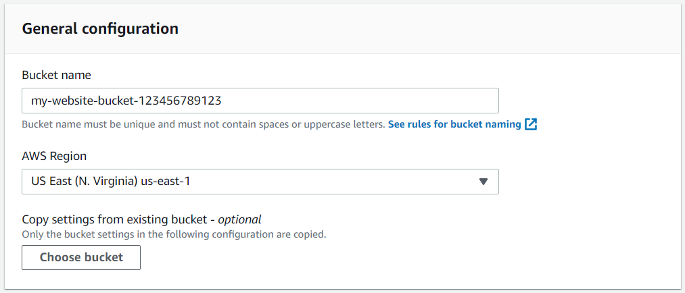
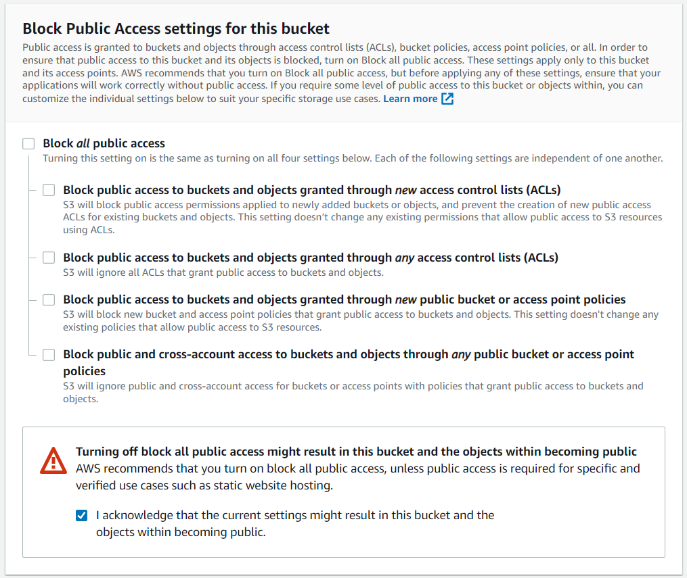
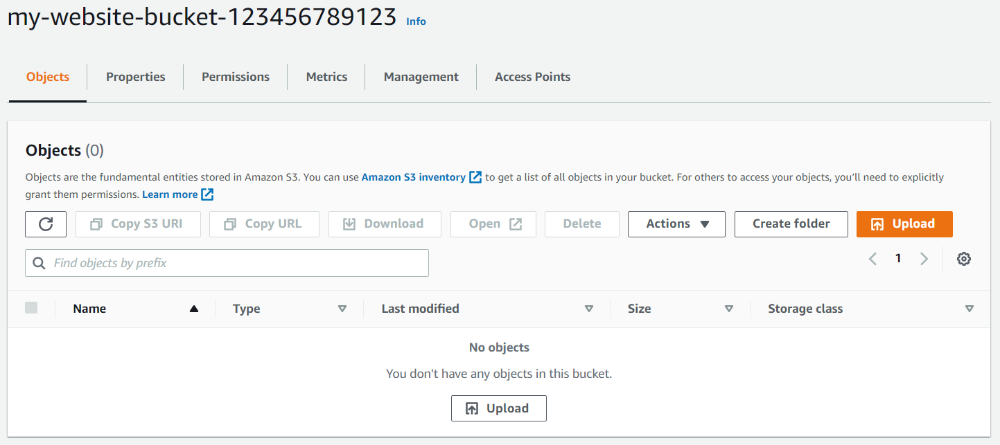
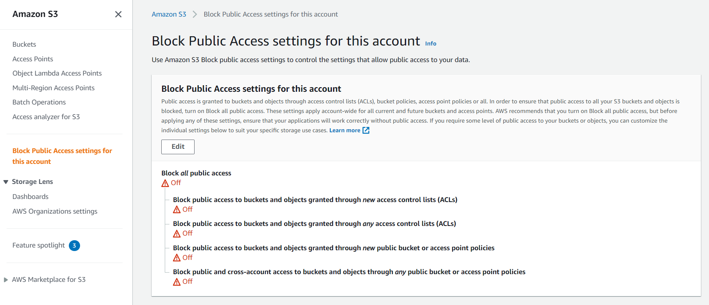

# Part 1 - Create S3 Bucket

## With AWS Management Console

- On AWS Management Console navigate to `S3` > `Buckets` > `Create bucket`

- In the General configuration, enter a "Bucket name" and a region of your choice.

  _Note_: Bucket names must be **globally unique**

  One of the convenient naming conventions is `my-website-bucket-123456789123`, where you can replace **123456789123** with your **12 digit AWS account ID**

  

- In the Bucket settings for Block Public Access section, **uncheck** the "**Block all public access**". It will enable the public access to the bucket objects via the S3 object URL

  _Note_ - We are allowing the public access to the bucket contents because we are going to host a static website in this bucket. Hosting requires the content should be **publicly readable**

  

- Click "Next" and click "Create bucket"

  

- Once the bucket is created, click on the name of the bucket to open the bucket to the contents

- Bucket my-014421265158-bucket configuration and content

  

## With AWS CLI

Make sure you set up a CLI profile with `aws configure`

In case you are using a different profile than `default`, remember to add `--profile <Profile Name>` at the end of each command

Also, remember replacing `my-website-bucket-123456789123` with the name of your bucket

- Create the S3 bucket

  ```sh
  aws s3 mb "s3://my-website-bucket-123456789123" --region <Region>
  ```

- Enable Public Access to the bucket

  ```sh
  aws s3api put-public-access-block \
      --bucket your-bucket-name \
      --public-access-block-configuration "BlockPublicAcls=false,IgnorePublicAcls=false,BlockPublicPolicy=false,RestrictPublicBuckets=false"
  ```

- In case if the above command fails, you might need to remove Block Public Access settings for this account

  - Navigate to `S3` > `Block Public Access settings for this account`, click edit and **uncheck** `Block all public access`

  
