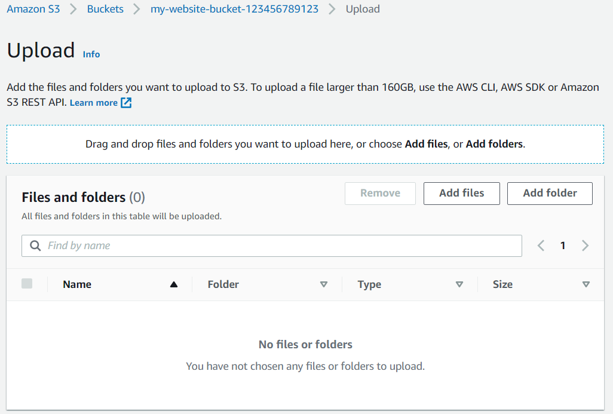
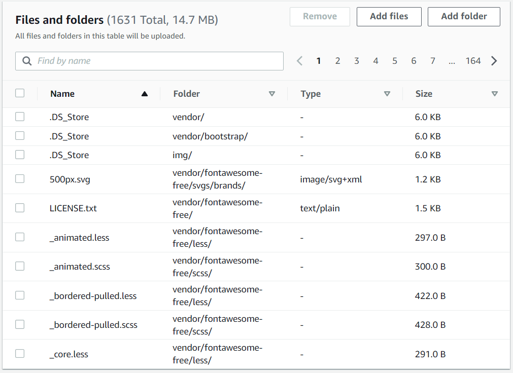

# Part 2 - Upload files

## With AWS Management Console

- On AWS Management Console navigate to `S3` > `Buckets` > `<The Bucket We Created>` > `Upload`

- Upload files to S3 Bucket Once the bucket is open to its contents, click the "Upload" button.

  

- From the [Student-ready starter code](https://drive.google.com/open?id=15vQ7-utH7wBJzdAX3eDmO9ls35J5_sEQ)

  - Click `Add files` to upload the **index.html** file

    

  - Click `Add folder` to upload the **css**, **img**, and **vendor** folders

    

**Do not select the udacity-starter-website folder. Instead, upload its content one-by-one**

**\_\_MACOSX folder would cause long upload time, and it's unnecessary for our website**

Successfully uploaded starter code in the bucket


## With AWS CLI

Make sure you set up a CLI profile with `aws configure`

In case you are using a different profile than `default`, remember to add `--profile <Profile Name>` at the end of each command

Also, remember replacing `my-website-bucket-123456789123` with the name of your bucket

- Open the terminal inside the starter code folder and type the following commands

  ```sh
  aws s3 cp index.html s3://my-website-bucket-123456789123/

  aws s3 cp vendor/ s3://my-website-bucket-123456789123/vendor/ --recursive

  aws s3 cp css/ s3://my-website-bucket-123456789123/css/ --recursive

  aws s3 cp img/ s3://my-website-bucket-123456789123/img/ --recursive
  ```
