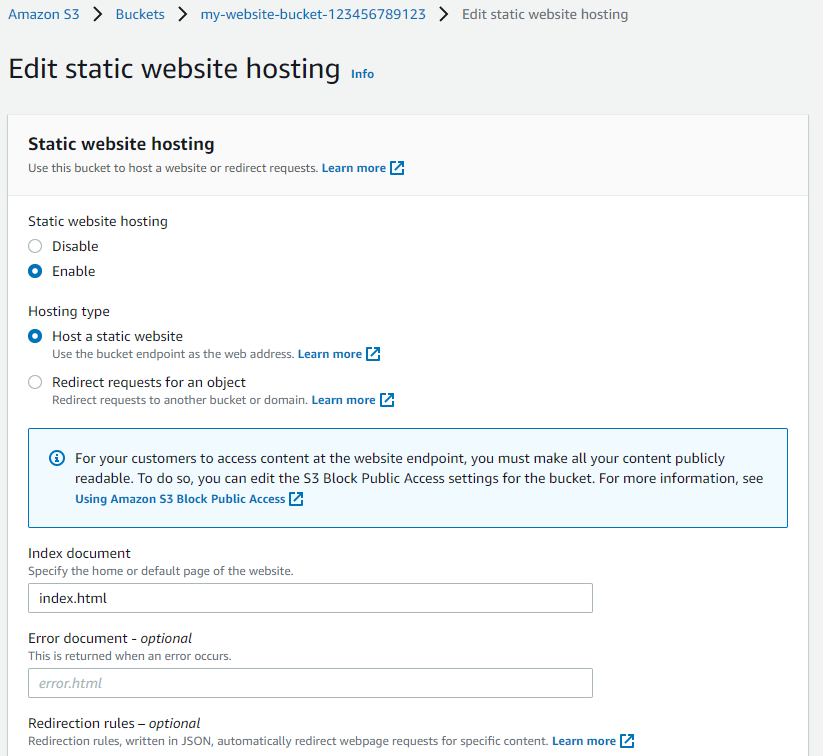
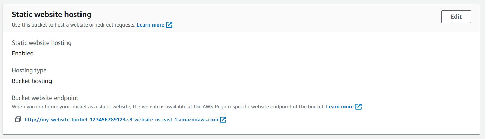

# Part 4 - Configure S3 Bucket

## With AWS Management Console

- Go to the `Properties` tab and then scroll down to edit the `Static website hosting` section

- Click on the "Edit" button to see the Edit static website hosting screen

- Now, **enable** the Static website hosting, and provide the default home page (`index.html`) and error page for your website (optional)

  

_Did you notice that enabling the static website hosting requires you to make your bucket public?_

_In the snapshot above, it says "**For your customers to access the content at the website endpoint, you must make all your content publicly readable.**"_

For both "Index document" and "Error document", enter "index.html" and click "Save"

After successfully saving the settings, check the Static website hosting section again under the Properties tab. You must now be able to view the website endpoint as shown below:



## With AWS CLI

Make sure you set up a CLI profile with `aws configure`

In case you are using a different profile than `default`, remember to add `--profile <Profile Name>` at the end of each command

Also, remember replacing `my-website-bucket-123456789123` with the name of your bucket

```sh
aws s3 website "my-website-bucket-123456789123" \
    --index-document index.html
    --error-document index.html
```
