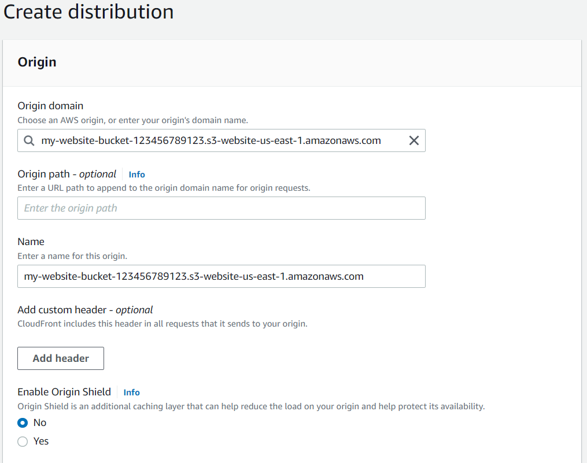

# Part 5 - Distribute Website via CloudFront

## With AWS Management Console

- On AWS Management Console navigate to `S3` > `CloudFront` > `Create Distribution`

  Use the following details to create a distribution:

  | Field                         | Value                                                                                                                                                                 |
  | ----------------------------- | --------------------------------------------------------------------------------------------------------------------------------------------------------------------- |
  | Origin > Origin domain        | \* **Don't select the bucket from the dropdown list**<br><br> Paste the Static website hosting endpoint of the form **<bucket-name>.s3-website-region.amazonaws.com** |
  | Origin > Enable Origin Shield | No                                                                                                                                                                    |

  

- Leave the defaults for the rest of the options, and click "Create Distribution"

- _Note_: It may take up to 10 minutes for the CloudFront Distribution to be created

- Once the status of your distribution changes from "**In Progress**" to "**Deployed**", copy the **endpoint URL for your CloudFront distribution** found in the "**Domain Name**" column

  _Note_ - Remember, as soon as your CloudFront distribution is Deployed, it attaches to S3 and starts caching the S3 pages. CloudFront may take 10-30 minutes (or more) to cache the S3 page. Once the caching is complete, the CloudFront domain name URL will stop redirecting to the S3 object URL

- In this example, the Domain Name value is `d297v6sdn6yi86.cloudfront.net`, but yours will be different.

  

## With AWS CLI

Make sure you set up a CLI profile with `aws configure`

In case you are using a different profile than `default`, remember to add `--profile <Profile Name>` at the end of each command

Also, remember replacing `my-website-bucket-123456789123` with the name of your bucket

- Create a CloudFront Distribution Config file (`dist-conf.json`)

  ```json
  {
    "CallerReference": "cli-example",
    "Comment": "",
    "Enabled": true,
    "DefaultCacheBehavior": {
      "TargetOriginId": "my-website-bucket-123456789123.s3-website-us-east-1.amazonaws.com",
      "ViewerProtocolPolicy": "allow-all",
      "MinTTL": 0,
      "ForwardedValues": {
        "QueryString": false,
        "Cookies": {
          "Forward": "none"
        }
      }
    },
    "Origins": {
      "Items": [
        {
          "Id": "my-website-bucket-123456789123.s3-website-us-east-1.amazonaws.com",
          "DomainName": "my-website-bucket-123456789123.s3-website-us-east-1.amazonaws.com",
          "OriginShield": {
            "Enabled": false
          },
          "CustomOriginConfig": {
            "HTTPPort": 80,
            "HTTPSPort": 443,
            "OriginProtocolPolicy": "http-only"
          }
        }
      ],
      "Quantity": 1
    }
  }
  ```

- In the same folder where the config JSON exists

  ```sh
  aws cloudfront create-distribution \
    --distribution-config file://dist-conf.json --profile udacity-aws
  ```
