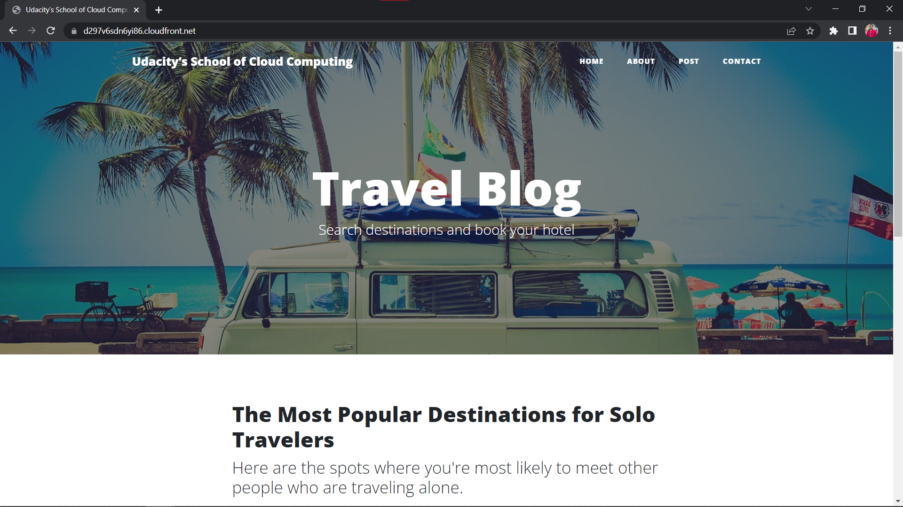

# Access Website in Web Browser

_Note_ - In the steps below, the exact domain name and the S3 URLs will be different in your case

- Open a web browser like Google Chrome, and paste the copied CloudFront domain name (such as, `d297v6sdn6yi86.cloudfront.net`) **without appending /index.html at the end**

  The CloudFront domain name should show you the content of the default home-page, as shown below:

  

- Access the website via website-endpoint, such as http://my-website-bucket-123456789123.s3-website-us-east-1.amazonaws.com

- Access the bucket object via its S3 object URL, such as, https://my-website-bucket-123456789123.s3.amazonaws.com/index.html

All three links: CloudFront domain name, S3 object URL, and website-endpoint will show you **the same index.html** content.

| Source                  | Link                                                                     |
| ----------------------- | ------------------------------------------------------------------------ |
| CloudFront Distribution | https://d297v6sdn6yi86.cloudfront.net                                    |
| S3 Website Endpoint     | http://my-website-bucket-123456789123.s3-website-us-east-1.amazonaws.com |
| S3 Object URL           | https://my-website-bucket-123456789123.s3.amazonaws.com/index.html       |

If we were not "hosting" the website on S3, we could have made the bucket private and host the content only through the CloudFront domain name. In such a case, we cannot access the private content using S3 object URL and website-endpoint
