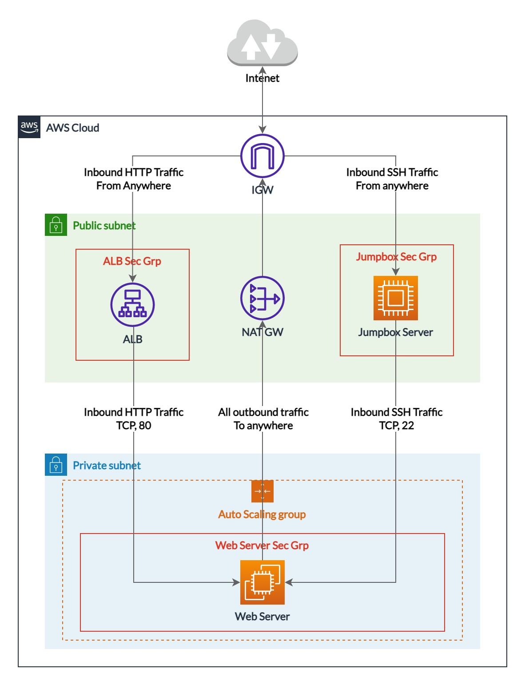

# Building Highly Available Compute Power

A highly available compute on EC2 consists of the following resources:

- 3 Security Groups (Load Balancer, Web Servers, and Jumpbox Server)
- IAM Resources
  - 1 Role
  - 1 Policy
  - 1 Instance Profile
- Auto Scaling Resources
  - 1 Launch Configuration
  - 1 Auto-Scaling Group
  - 1 Auto-Scaling Policy
- Elastic Load Balancing Resources
  - 1 Target Group
  - 1 Application Load Balancer
  - 1 Listener
  - 1 Listener Rule

## Traffic firewall

All traffic paths are summarized in the below diagram



### Jumpbox Security Group

Inbound Rules:

- Allow SSH Traffic on port 22 from anywhere

  Ideally the source should be limited to your own IP address only but for simplicity we are allowing traffic from anywhere

| Protocol | Port | Source    |
| -------- | ---- | --------- |
| TCP      | 22   | 0.0.0.0/0 |

Outbound rules: Unrestricted

### ALB Security Group

Inbound Rules:

- Allow HTTP Traffic on port 80 from anywhere

| Protocol | Port | Source    |
| -------- | ---- | --------- |
| TCP      | 80   | 0.0.0.0/0 |

Outbound Rules: Unrestricted

### Web Server Security Group

Inbound Rules:

- Allow HTTP Traffic on port 80 **only** from a resource having the **ALB Security Group**

  This allows our web service to be accessible from the Load Balancer only

- Allow SSH Traffic on port 22 **only** from a resource having the **Jumpbox Security Group**

  This makes SSH access to our web servers to be only allowed from the Jumpbox

| Protocol | Port | Source                 |
| -------- | ---- | ---------------------- |
| TCP      | 80   | ALB Security Group     |
| TCP      | 22   | Jumpbox Security Group |

So the final Security Groups definition would be like this

```yml
Parameters:
  EnvironmentName:
    Description: The name of the deployment
    Type: String
    Default: My-HA-App

Properties:
  JumpboxSecurityGroup:
    Type: AWS::EC2::SecurityGroup
    Properties:
    VpcId:
      Fn::ImportValue: !Sub "${EnvironmentName}-VPC"
    GroupDescription: Allow SSH from anywhere
    SecurityGroupIngress:
      - IpProtocol: tcp
        FromPort: 22
        ToPort: 22
        CidrIp: 0.0.0.0/0

  ALBSecurityGroup:
    Type: AWS::EC2::SecurityGroup
    Properties:
    VpcId:
      Fn::ImportValue: !Sub "${EnvironmentName}-VPC"
    GroupDescription: Allow HTTP from anywhere, and HTTP to the Web Servers
    SecurityGroupIngress:
      - IpProtocol: tcp
        FromPort: 80
        ToPort: 80
        CidrIp: 0.0.0.0/0

  WebServerSecurityGroup:
    Type: AWS::EC2::SecurityGroup
    Properties:
    VpcId:
      Fn::ImportValue: !Sub "${EnvironmentName}-VPC"
    GroupDescription: Allow SSH from JumpBox and HTTP from the ALB
    SecurityGroupIngress:
      - IpProtocol: tcp
        FromPort: 80
        ToPort: 80
        SourceSecurityGroupId: !Ref ALBSecurityGroup
      - IpProtocol: tcp
        FromPort: 22
        ToPort: 22
        SourceSecurityGroupId: !Ref JumpboxSecurityGroup
```

## Controlling Access with IAM

We would have an S3 bucket containing our static website files, and then we shall have a group of EC2 instances that would need to fetch these files

The bucket itself is not allowing public access, so we need to create IAM resources

Let's define the bucket name as a parameter in the `Parameters` section

```yml
Parameters:
  # ...
  BucketName:
    BucketName:
      Description: The bucket containing static website files
      Type: String
      Default: demo-website-667184564057
```

### A Role to access the bucket

First thing to do is to create a role that grants EC2 instances the required access to read the bucket

Required properties

- **Assume Role Policy Document**

  The trust policy that is associated with this role. Trust policies define which entities can assume the role

```yml
Resources:
  # ...
  EC2S3AccessRole:
    Type: AWS::IAM::Role
    Properties:
      AssumeRolePolicyDocument:
        Version: "2012-10-17"
        Statement:
          - Effect: "Allow"
            Principal:
              Service:
                - "ec2.amazonaws.com"
            Action:
              - "sts:AssumeRole"
```

### The policy to grant access to the bucket

In [this](https://aws.amazon.com/premiumsupport/knowledge-center/s3-troubleshoot-copy-between-buckets/) troubleshooting guide for copying files between S3 buckets we can learn that the `sync` operation needs the following permissions

- Object level permissions: `s3:GetObject`, `s3:PutObject`, `s3:DeleteObject`
- Bucket level permissions: `s3:ListBucket`, `s3:GetBucketLocation`

The policy document can be something like this

```json
{
  "Version": "2012-10-17",
  "Statement": [
    {
      "Effect": "Allow",
      "Action": ["s3:PutObject", "s3:GetObject", "s3:DeleteObject"],
      "Resource": "arn:aws:s3:::BUCKET_NAME/*"
    },
    {
      "Effect": "Allow",
      "Action": ["s3:ListBucket", "s3:GetBucketLocation"],
      "Resource": "arn:aws:s3:::BUCKET_NAME"
    }
  ]
}
```

_Note_: Since we only need the EC2 instances to fetch the files only and no editing is needed, so read only operations are needed

```json
{
  "Version": "2012-10-17",
  "Statement": [
    {
      "Effect": "Allow",
      "Action": ["s3:GetObject"],
      "Resource": "arn:aws:s3:::BUCKET_NAME/*"
    },
    {
      "Effect": "Allow",
      "Action": ["s3:ListBucket", "s3:GetBucketLocation"],
      "Resource": "arn:aws:s3:::BUCKET_NAME"
    }
  ]
}
```

As for the policy resource, we need to define the following properties

- **Policy Name**

  The name of the policy document

- **Policy Document**

  The policy document

- **Roles**

  The name of the role to associate the policy with

```yml
Properties:
  # ...
  S3AccessPolicy:
    Type: AWS::IAM::Policy
    Properties:
      PolicyName: S3AccessPolicy
      PolicyDocument:
        Version: "2012-10-17"
        Statement:
          - Effect: Allow
            Action:
              - s3:GetObject
            Resource: !Sub "arn:aws:s3:::${BucketName}/*"
          - Effect: Allow
            Action:
              - s3:ListBucket
              - s3:GetBucketLocation
            Resource: !Sub "arn:aws:s3:::${BucketName}"
      Roles:
        - !Ref EC2S3AccessRole
```

### The instance profile that would be attached

An instance profile would be needed to assign role permissions to an EC2 instance

Properties needed:

- **Roles**

  The name of the role to associate with the instance profile

```yml
Properties:
  WebServerInstanceProfile:
    Type: AWS::IAM::InstanceProfile
    Properties:
      Roles:
        - !Ref EC2S3AccessRole
```
