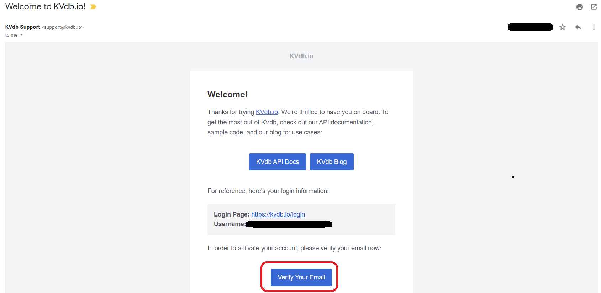
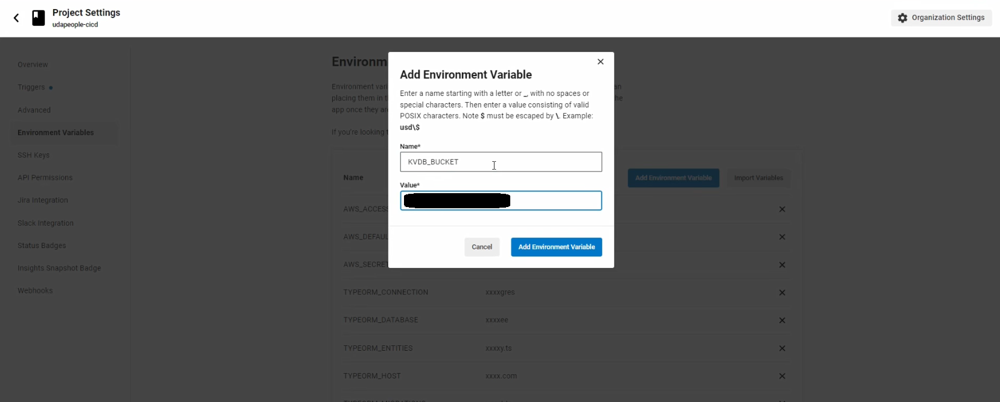
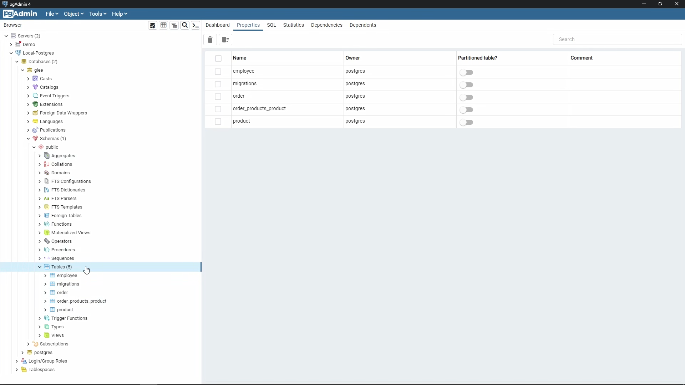

# Part 10 - Run Migrations Stage

Write code that runs database migrations so that new changes are applied. Save some evidence that any new migrations ran. This is useful information if you need to roll back

## Objectives

- Create an Account on [KVdb.io](https://kvdb.io) or another similar service
- Store KVdb bucket name on CircleCI
- Run the migration script on a Node.js enabled base image
- Add revert migrations rollback command

## Overview

_Note 1_: Before going through this part, please revise related steps in part 7, namely

- [Creating a Publicly Accessible Database](./7-configuration-management-setup.md#create-a-publicly-accessible-postgresql-database-in-rds)
- [Setting Environment Variables](./7-configuration-management-setup.md#set-environment-variables)

_Note 2_: This stage has to be executed on an image that supports **Node.js 13.8.0**, any other version of Node.js would simply do not work properly, we can install this specific version of Node.js in the following step

### Install Node.js 13.8.0 on base image

We can create a command that executes the logic defined in part 8 - [Node.js installation workaround](./9-configure-infrastructure-stage.md#important-nodejs-installation-workaround)

`.circlci/config.yml`

```yml
commands:
  ...
  install_nodejs:
    description: Install Node.js 13.8.0
    steps:
      - run:
          name: Install Node.js 13.8.0
          command: |
            # Install Node.js LTS version as our base Node.js version
            curl -fsSL https://deb.nodesource.com/setup_lts.x | sudo -E bash -
            sudo apt install -y nodejs

            # Use n version manager to use Node.js v13.8.0
            sudo npm install --global n
            sudo n 13.8.0
```

### Getting Started with KVdb.io

We need to share information about the migrations that have been run on the database, for that we will use [KVdb.io](https://kvdb.io)

KVdb API lets you store multiple keys-values in a bucket. Creating and using a KVdb bucket is reasonably straightforward, as shown below. After creating a bucket, you can keep as many keys and associated values as you desire

#### Using KVdb REST API

Using KVdb REST API for storing key values is a four-step process:

1.  Create a bucket

    The first step is to create a bucket using your email ID as an account. The command to create a bucket is

    ```sh
    curl -d 'email=your-email-ID@domain.com' https://kvdb.io
    # Returns a bucket ID, such as, "XsgrYuyPESbxCcte4sLxEM"
    ```

    A bucket is marked as public by default, meaning, you can access the key-values from any terminal if you know the bucket ID correctly. Also, you can create multiple buckets under your account

    _Note_: For the first time, you will have to **verify your email ID using the email received in your mailbox**. If not activated you will receive errors and the bucket wouldn't be available

    

2.  Store the key-value pair

    Choose a key-value pair of your choice. In the example below, we have chosen **migration\_${CIRCLE_WORKFLOW_ID:0:7}** as the **key**, and **1** as the **value**

    The command to store a key-value pair is:

    ```sh
    curl https://kvdb.io/[bucket-ID]/[key] -d '[value]'
    ```

    Example:

    ```sh
    curl https://kvdb.io/${KVDB_BUCKET}/migration_${CIRCLE_WORKFLOW_ID:0:7} -d '1'
    ```

3.  Access the value associated with a key

    The last step is to access the value associated with a particular key. The command is

    ```sh
    curl --insecure https://kvdb.io/[bucket-ID]/[key]
    ```

    Example:

    ```sh
    curl --insecure https://kvdb.io/${KVDB_BUCKET}/migration_${CIRCLE_WORKFLOW_ID:0:7}
    ```

#### Integrating KVdb.io Bucket ID in CircleCI

On CircleCI project navigate to `Project Settings` > `Environment Variables` and add the following variables (without < > characters)

```
KVDB_BUCKET=<KVdb.io Bucket ID returned from step 1>
```



### `revert-migrations` Command

In case any failure occurred in the current pipeline, we need to revert the migrations that are made to the database (in case if there's any)

`.circleci/config.yml`

```yml
commands:
  ...
  revert-migrations:
    description: Revert the last migration, if any were executed during the current workflow
    parameters:
      Workflow_ID:
        type: string
        default: ${CIRCLE_WORKFLOW_ID:0:7}
    steps:
      - run:
          name: Revert migrations
          when: on_fail
          command: |
            SUCCESS=$(curl --insecure  https://kvdb.io/${KVDB_BUCKET}/migration_<< parameters.Workflow_ID >>)

            # Logic for reverting the database state
            if (( $SUCCESS == 1 ));
            then
              cd ~/project/backend
              npm install
              npm run migration:revert
            fi
```

## Implementation

### `run-migrations` Job

Executor environment, we'll use `cimg/python:3.10` as discussed in the previous part

`.circleci/config.yml`

```yml
run-migrations:
  docker:
    - image: cimg/python:3.10
```

---

Steps

1. `checkout` command to check out the code

   `.circleci/config.yml`

   ```yml
   - checkout
   ```

2. Install required tools: The commands we created in [part 7](./7-configuration-management-setup.md#add-installation-commands), in addition to installing [Node.js 13.8.0](#install-nodejs-1380-on-base-image)

   `.circleci/config.yml`

   ```yml
   - install_awscli
   - install_nodejs
   ```

3. `restore_cache`: The built-in feature in CircleCI to cache dependencies so that it doesn't take much time

   `.circleci/config.yml`

   ```yml
   - restore_cache:
       keys: [backend-deps]
   ```

4. Installing node dependencies and storing migration output to text file

   `.circleci/config.yml`

   ```yml
   - run:
       name: Run migrations
       command: |
         cd backend
         npm install
         npm run migrations > migrations_dump.txt
         cat migrations_dump.txt
   ```

5. Storing a KVdb.io key if there are any migrations have been executed during the current workflow

   `.circleci/config.yml`

   ```yml
   - run:
       name: Send migration status to kvdb.io
       command: |
         if grep -q "has been executed successfully." ~/project/backend/migrations_dump.txt
         then
           curl https://kvdb.io/${KVDB_BUCKET}/migration_${CIRCLE_WORKFLOW_ID:0:7}  -d '1'
         else
           echo "No migrations are pending" 
         fi
   ```

6. In case any failure occurs, add rollback commands

   `.circleci/config.yml`

   ```yml
   - destroy-environment
   - revert-migrations
   ```

#### Workflow update

Then update the workflow at the end of config.yml

```yml
workflows:
  default:
    jobs:
      ...
      - run-migrations:
          requires: [configure-infrastructure]
```

---

Commit and push these changes to trigger a new workflow on CircleCI

---

### Sanity check

Connect to the database via pgAdmin and verify it the migrations has been applied, the same as we did in [part 6](6-udapeople-app.md#apply-database-migrations)



## FAQs

To be added
