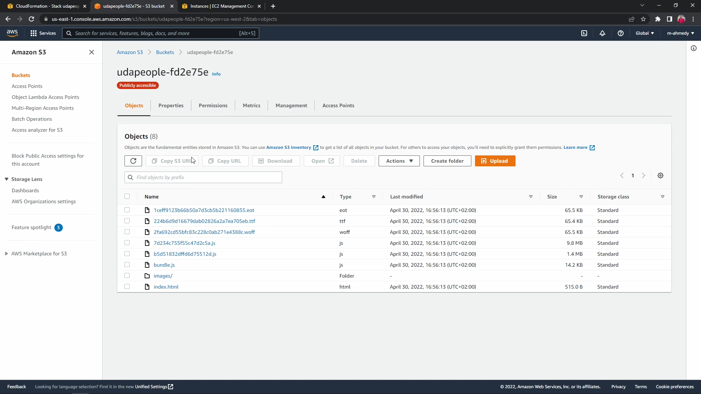
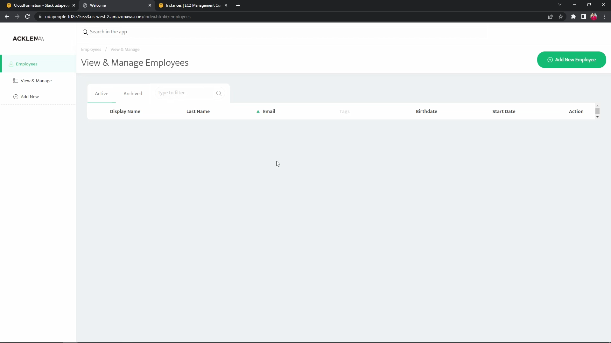

# Part 11 - Deploy to Production

## Objectives

- Deploy Backend production app to the configured EC2 instances
- Deploy Frontend production static files to the S3 bucket

## Affected files

- CircleCI configuration file `.circleci/config.yml`
- Deploy backend Ansible playbook `.circleci/ansible/deploy-backend.yml`
- Deploy backend Ansible role tasks and files `.circleci/ansible/roles/deploy/{tasks/main.yml, files/*}`

## Implementation

### Deploying the frontend

#### Generating production build

We need to rebuild the frontend, this time with the `API_URL` environment variable referring to the current backend instance backed in

It can be either backed inside the `frontend/.env` file or simply with an `export` command

The CLI command of getting the URL of the current backend is explained at part 8 - [CLI refresher](./8-deploy-infrastructure-stage.md#aws-cli-refresher)

```sh
# Get the backend URL
BACKEND_PUBLIC_IP=$(aws ec2 describe-instances \
  --filters "Name=tag:Name,Values=backend-<IDENTIFIER>" \
  --query 'Reservations[*].Instances[*].PublicIpAddress' \
  --output text)

# Bake API_URL Environment Variable
# Simple export
export API_URL=http://$BACKEND_PUBLIC_IP:3030
# Or
echo "API_URL=http://$BACKEND_PUBLIC_IP:3030" > frontend/.env

# Build the frontend
cd frontend
npm run build
```

#### Copying build artifacts to the current S3 bucket

The build artifacts are stored inside the `frontend/dist` folder

We have to copy build artifacts to the current S3 bucket

```sh
## After building the frontend
cd frontend

aws s3 cp dist s3://udapeople-<IDENTIFIER> --recursive
# Or
aws s3 sync dist s3://udapeople-<IDENTIFIER>

```

#### `deploy-frontend` Job

Executor environment, we'll use `cimg/python:3.10`

`.circleci/config.yml`

```yml
deploy-frontend:
  docker:
    - image: cimg/python:3.10
```

---

Steps

1. `checkout` command to check out the code

   `.circleci/config.yml`

   ```yml
   - checkout
   ```

2. Install required tools: The commands we created in [part 7](./7-configuration-management-setup.md#add-installation-commands), in addition to installing [Node.js 13.8.0](#install-nodejs-1380-on-base-image)

   `.circleci/config.yml`

   ```yml
   - install_awscli
   - install_nodejs
   ```

3. `restore_cache`: The built-in feature in CircleCI to cache dependencies so that it doesn't take much time

   `.circleci/config.yml`

   ```yml
   - restore_cache:
       keys: [backend-deps]
   ```

4. Installing node dependencies

   `.circleci/config.yml`

   ```yml
   - run:
       name: Install dependencies
       command: |
         cd frontend
         npm install
   ```

5. Getting backend URL and storing it in the frontend environment file

   `.circleci/config.yml`

   ```yml
   - run:
       name: Get backend url
       command: |
         BACKEND_PUBLIC_IP=$(aws ec2 describe-instances \
           --filters "Name=tag:Name,Values=backend-${CIRCLE_WORKFLOW_ID:0:7}" \
           --query 'Reservations[*].Instances[*].PublicIpAddress' \
           --output text)

         echo "API_URL=http://${BACKEND_PUBLIC_IP}:3030" >> frontend/.env
         cat frontend/.env
   ```

6. Deploying the frontend to the bucket

   `.circleci/config.yml`

   ```yml
   - run:
     name: Deploy frontend objects
     command: |
       cd frontend
       npm run build
       aws s3 cp dist s3://udapeople-${CIRCLE_WORKFLOW_ID:0:7} --recursive
   ```

7. Rollback commands

   `.circleci/config.yml`

   ```yml
   - destroy-environment
   - revert-migrations
   ```

---

Workflow update

Then update the workflow at the end of config.yml

```yml
workflows:
  default:
    jobs:
      ...
      - deploy-frontend:
          requires: [run-migrations]
```

---

### Deploying the backend

#### Generating production build

To keep the production as lean as possible we need the following

- Production build artifacts `backend/dist`
- Package information to generate all needed node_modules `package.json`, `package-lock.json`

Then we archive the mentioned files inside one archive, and then we can send it via Ansible role files

But first we need to make sure the `files` folder exists in the `deploy` role by creating a simple readme.md file at that location

`.circleci/ansible/roles/deploy/files/readme.md`

```markdown
## Deployment files goes here
```

The mentioned steps can be realized with the following commands

```sh
# Generate production build of the backend
cd backend
npm run build

# Archive the contents of the dist folder, along with backned package information
cd backend
tar -czf artifact.tar.gz dist/* package*

# Copy the files to the deploy role files folder to prepare for deploying it via ansible
cd .circleci
cp backend/artifact.tar.gz .circleci/ansible/roles/deploy/files

```

#### Preparing the Ansible play

We have this skeleton code of the ansible playbook in our starter code

`.circleci/ansible/deploy-backend.yml`

```yml
---
- name: "configuration play."
  hosts: web
  user: ubuntu
  gather_facts: false
  vars:
    - ansible_python_interpreter: /usr/bin/python3
    - ansible_host_key_checking: false
    - ansible_stdout_callback: yaml
  roles:
    - deploy
```

Sections to complete:

- Waiting for connection pre-task
- Verifying Python installation on the managed node pre-task
- Import environment variables from CircleCI
- Delegate tasks to roles (`deploy`)

_Note_: All tasks in this playbook (and its roles) **does not** require **root** privileges, so we **will not** define `become: true` on the play level and as a result all tasks will be executed with **normal user** privileges

##### Initial playbook config

The same config can be followed as stated in [part 9](./9-configure-infrastructure-stage.md#initial-playbook-config)

##### Pre-tasks

The same config can be followed as stated in [part 9](./9-configure-infrastructure-stage.md#pre-tasks)

##### Setting Environment variables

We need the backend node to have a set of environment variables set while running the app

This can be set in the `environment` field of the play

```yml
environment:
  NODE_ENV: production
  VERSION: "1"
  TYPEORM_CONNECTION: "{{ lookup('env', 'TYPEORM_CONNECTION') }}"
  TYPEORM_MIGRATIONS_DIR: "{{ lookup('env', 'TYPEORM_MIGRATIONS_DIR') }}"
  TYPEORM_ENTITIES: "{{ lookup('env', 'TYPEORM_ENTITIES') }}"
  TYPEORM_MIGRATIONS: "{{ lookup('env', 'TYPEORM_MIGRATIONS') }}"
  TYPEORM_HOST: "{{ lookup('env', 'TYPEORM_HOST') }}"
  TYPEORM_PORT: "{{ lookup('env', 'TYPEORM_PORT') }}"
  TYPEORM_USERNAME: "{{ lookup('env', 'TYPEORM_USERNAME') }}"
  TYPEORM_PASSWORD: "{{ lookup('env', 'TYPEORM_PASSWORD') }}"
  TYPEORM_DATABASE: "{{ lookup('env', 'TYPEORM_DATABASE') }}"
```

##### Delegate tasks to Roles

In the `roles` section we will delegate the tasks to the only role

```yml
roles:
  - deploy
```

#### `deploy` Role tasks

1. Create the folder for the app to live in

   `.circleci/ansible/roles/deploy/tasks/main.yml`

   ```yml
   ---
   - name: "Creates backend app directory"
     file:
       path: ~/backend-app
       state: directory
   ```

1. Move and unarchive the artifact file

   `.circleci/ansible/roles/deploy/tasks/main.yml`

   ```yml
   - name: "Unarchive backend files"
     unarchive:
       src: artifact.tar.gz
       dest: ~/backend-app
   ```

1. Installing Node Dependencies

   `.circleci/ansible/roles/deploy/tasks/main.yml`

   ```yml
   - name: "Installing Node Dependencies"
     shell: |
       cd ~/backend-app
       npm i
   ```

1. Executing Node app with PM2, the Node.js process manager

   _Note_: Keep in mind as we are launching the production build from inside the **dist** folder, relative path environment variables needs to be updated, for more info see this section of [part 6](6-udapeople-app.md#launch-the-production-build-of-the-backend)

   `.circleci/ansible/roles/deploy/tasks/main.yml`

   ```yml
   - name: "Executing Node app with PM2"
     shell: |
       cd ~/backend-app/dist
       pm2 stop default
       pm2 start main.js

     register: execute_node

   - name: print message
     debug:
       msg: "{{ execute_node.stdout_lines }}"
   ```

1. Using [PM2 startup guide](https://pm2.keymetrics.io/docs/usage/startup), we set up our application to be restarted on startup

   ```yml
   - name: "Configure pm2 to start as service"
     shell: |
       sudo su -c "env PATH=$PATH:/usr/local/bin pm2 startup systemd -u ubuntu --hp /home/ubuntu"
       pm2 save
   ```

#### `deploy-backend` Job

Executor environment, we'll use `cimg/python:3.10`

`.circleci/config.yml`

```yml
deploy-backend:
  docker:
    - image: cimg/python:3.10
```

---

Steps

1. `checkout` command to check out the code

   `.circleci/config.yml`

   ```yml
   - checkout
   ```

2. Install required tools: The commands we created in [part 7](./7-configuration-management-setup.md#add-installation-commands), in addition to installing [Node.js 13.8.0](#install-nodejs-1380-on-base-image)

   `.circleci/config.yml`

   ```yml
   - install_ansible
   - install_awscli
   - install_nodejs
   ```

3. `restore_cache`: The built-in feature in CircleCI to cache dependencies so that it doesn't take much time

   `.circleci/config.yml`

   ```yml
   - restore_cache:
       keys: [backend-deps]
   ```

4. Add SSH Fingerprint for Ansible SSH access, here we use the fingerprint created in [part 7](7-configuration-management-setup.md#add-ssh-key)

   `.circleci/config.yml`

   ```yml
   - add_ssh_keys:
       fingerprints: ["d5:a4:0d:bd:36:a7:d2:03:2c:10:93:6a:7c:d1:a7:26"]
   ```

5. Attach the workspace to retrieve the inventory file

   `.circleci/config.yml`

   ```yml
   - attach_workspace:
       at: ~/
   ```

6. Installing node dependencies

   `.circleci/config.yml`

   ```yml
   - run:
       name: Install dependencies
       command: |
         cd backend
         npm install
   ```

7. Packaging the backend

   `.circleci/config.yml`

   ```yml
   - run:
       name: Package Backend
       command: |
         cd backend
         npm run build
         tar -czf artifact.tar.gz dist/* package*

         cd ..
         cp backend/artifact.tar.gz .circleci/ansible/roles/deploy/files
   ```

8. Setting updated environment variables, and executing the `deploy-backend` Ansible playbook

   `.circleci/config.yml`

   ```yml
   - run:
       name: Deploy backend
       command: |
         export TYPEORM_MIGRATIONS_DIR=./migrations
         export TYPEORM_ENTITIES=./modules/domain/**/*.entity{.ts,.js}
         export TYPEORM_MIGRATIONS=./migrations/*.ts

         cd .circleci/ansible
         cat inventory.txt
         ansible-playbook -i inventory.txt deploy-backend.yml
   ```

9. Rollback commands

   `.circleci/config.yml`

   ```yml
   - destroy-environment
   - revert-migrations
   ```

---

Workflow update

Then update the workflow at the end of config.yml

```yml
workflows:
  default:
    jobs:
      ...
      - deploy-backend:
          requires: [run-migrations]
```

### Pushing changes

---

Commit and push these changes to trigger a new workflow on CircleCI

---

## Sanity check

### Frontend deployment

Go to the S3 dashboard and verify the current workflow bucket is now containing frontend build artifacts



Also, you can visit the bucket website URL



### Backend deployment

Get the public IP address of the current backend, then curl the API status endpoint in a local terminal

```sh
curl http://<Backend Public IP>:3030/api/status
```

The backend shall respond with OK response

```json
{ "status": "ok", "environment": "production" }
```

## FAQs

To be added
