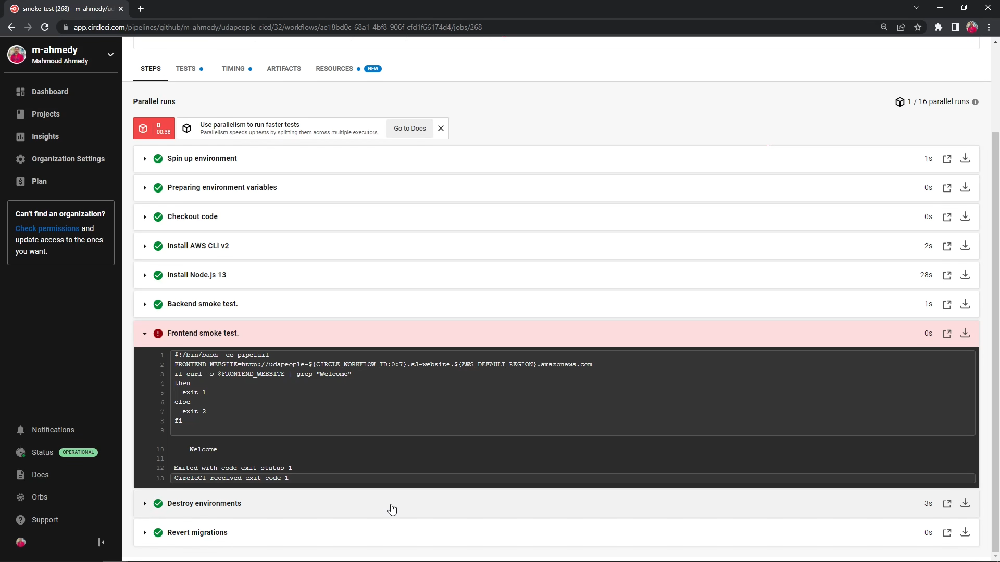
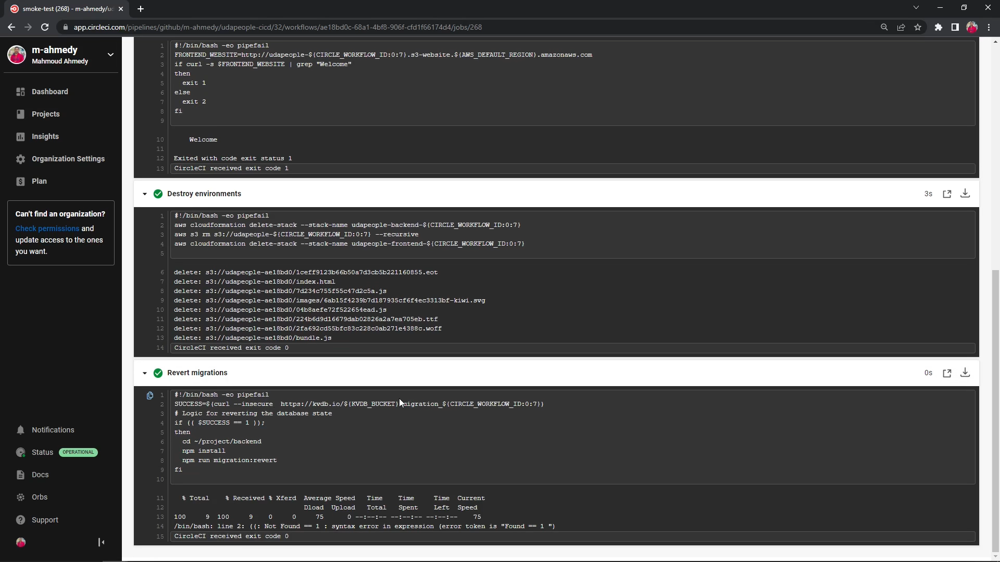

# Part 12 - Smoke Testing Stage

- Smoke Testing is a software testing process that determines whether the deployed software build is stable or not 
- It consists of a minimal set of tests run on each build to test software functionalities

## Objectives

- Run smoke testing on the backend
    - Fetching the API status information from the backend server
- Run smoke testing on the frontend
    - Fetching the index page from the bucket and ensuring it loads correctly

- Make one intentional failed smoke test to get the needed screenshots
    - Appropriate job failure for the smoke test job. [SCREENSHOT06]
    - Successful rollback after a failed smoke test. [SCREENSHOT07]

## Affected files

- CircleCI configuration file `.circleci/config.yml`

## Implementation

We will reuse the configuration from previous stages

`.circleci/config.yml`

```yml
...
jobs:
    ...
    smoke-test:
    docker:
      - image: cimg/base:stable
    steps:
      - checkout
      - install_awscli
      - install_nodejs
```

### Backend Smoke Test

It will be as simple as performing an HTTP Get request with `curl` on the API status endpoint and check the response for the OK status

Remember that exit code 0 is the only status code that means the operation has completed successfully

So in order to introduce an intentional error to the smoke testing stage, we can simply change the `exit 0` statement with any code other than 0, remember to fix it later on

```sh
# Extract the public IP address for the backend instance
BACKEND_PUBLIC_IP=$(aws ec2 describe-instances \
    --filters "Name=tag:Name,Values=backend-${CIRCLE_WORKFLOW_ID:0:7}" \
    --query 'Reservations[*].Instances[*].PublicIpAddress' \
    --output text)

# Generate the API URL
export API_URL=http://${BACKEND_PUBLIC_IP}:3030

# Performing a get request with curl and checking for "ok" in the response
if curl -s $API_URL/api/status | grep "ok"
then
    exit 0
else
    exit 1
fi
```

So the full backend smoke testing step can be like

`.circleci/config.yml`

```yml
...
- run:
    name: Backend smoke test.
    command: |
        BACKEND_PUBLIC_IP=$(aws ec2 describe-instances \
        --filters "Name=tag:Name,Values=backend-${CIRCLE_WORKFLOW_ID:0:7}" \
        --query 'Reservations[*].Instances[*].PublicIpAddress' \
        --output text)

        export API_URL=http://${BACKEND_PUBLIC_IP}:3030
        if curl -s $API_URL/api/status | grep "ok"
        then
            exit 0
        else
            exit 1
        fi
```

### Frontend Smoke Test

As for the frontend the smoke test is as simple as performing another HTTP Get request with `curl` to the website endpoint and check for the "Welcome" keyword

Remember to generate the website endpoint URL correctly, some regions differ in the URL format, for more information check [Website Endpoints](https://docs.aws.amazon.com/AmazonS3/latest/userguide/WebsiteEndpoints.html) on the official AWS Docs

```sh
FRONTEND_WEBSITE=http://udapeople-${CIRCLE_WORKFLOW_ID:0:7}.s3-website.${AWS_DEFAULT_REGION}.amazonaws.com
if curl -s $FRONTEND_WEBSITE | grep "Welcome"
then
    exit 0
else
    exit 1
fi
```

So the frontend step can be of the like

`.circleci/config.yml`

```yml
- run:
    name: Frontend smoke test.
    command: |
        FRONTEND_WEBSITE=http://udapeople-${CIRCLE_WORKFLOW_ID:0:7}.s3-website.${AWS_DEFAULT_REGION}.amazonaws.com
        if curl -s $FRONTEND_WEBSITE | grep "Welcome"
        then
            exit 0
        else
            exit 1
        fi
```

Also remember to add the rollback steps in case any failure occurs

`.circleci/config.yml`

```yml
- destroy-environment
- revert-migrations
```

So the full stage configuration will be similar to this sample here

`.circleci/config.yml`

```yml
smoke-test:
    docker:
      - image: cimg/base:stable
    steps:
      - checkout
      - install_awscli
      - install_nodejs
      - run:
          name: Backend smoke test.
          command: |
            BACKEND_PUBLIC_IP=$(aws ec2 describe-instances \
              --filters "Name=tag:Name,Values=backend-${CIRCLE_WORKFLOW_ID:0:7}" \
              --query 'Reservations[*].Instances[*].PublicIpAddress' \
              --output text)

            export API_URL=http://${BACKEND_PUBLIC_IP}:3030
            if curl -s $API_URL/api/status | grep "ok"
            then
              exit 0
            else
              exit 1
            fi
      - run:
          name: Frontend smoke test.
          command: |
            FRONTEND_WEBSITE=http://udapeople-${CIRCLE_WORKFLOW_ID:0:7}.s3-website.${AWS_DEFAULT_REGION}.amazonaws.com
            if curl -s $FRONTEND_WEBSITE | grep "Welcome"
            then
              # This is the intentional error, if "Welcome" is indeed in the response this step will exit with exit code 1
              exit 1
            else
              exit 2
            fi
      - destroy-environment
      - revert-migrations
```

### Workflow update

Then update the workflow at the end of config.yml

```yml
workflows:
  default:
    jobs:
      ...
      - smoke-test:
          requires: [deploy-backend, deploy-frontend]
```

---

Commit and push the changes to GitHub to trigger a workflow on CircleCI

---

The workflow will trigger, and if everything is done correctly it should fail at the smoke testing stage, the failure will trigger the rollback steps to take place and remove the current infrastructure

Take a screenshot of the failed smoke test [SCREENSHOT06]



And another screenshot of the done rollback steps [SCREENSHOT07]



Then go back and fix the exit codes

`.circleci/config.yml`

```yml
- run:
    name: Frontend smoke test.
    command: |
        FRONTEND_WEBSITE=http://udapeople-${CIRCLE_WORKFLOW_ID:0:7}.s3-website.${AWS_DEFAULT_REGION}.amazonaws.com
        if curl -s $FRONTEND_WEBSITE | grep "Welcome"
        then
            exit 0
        else
            exit 1
        fi
```

---

Commit and push the changes to GitHub to trigger a workflow on CircleCI

---

Now you're ready for the next step
