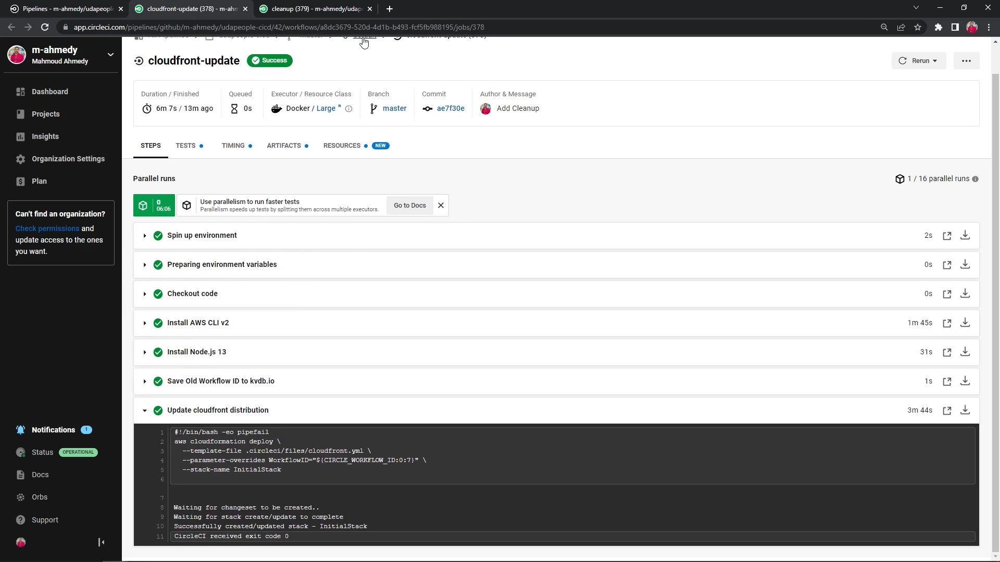
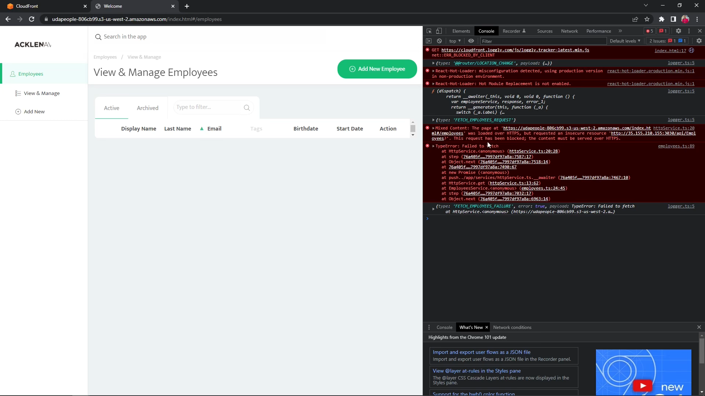
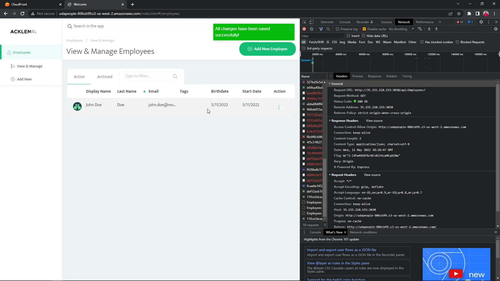

# Part 13 - Update CloudFront Distribution

After checking that our new (Blue) deployment is running fine and stable we can switch the CloudFront Distribution Origin to point to that new bucket instead of the old stable deployment (Green)

## Objectives

- Save the Green deployment's workflow ID to KVDB.io in order to later use it to remove this version
- Update the CloudFormation stack to point to the new (Blue) deployment

## Affected files

- CircleCI configuration file `.circleci/config.yml`

## Overview

If we inspect the CloudFront CloudFormation template file `.circleci/files/cloudfront.yml`, we can find it accepts a parameter called **WorkflowID**

`.circleci/files/cloudfront.yml`

```yml
Parameters:
  WorkflowID:
    Description: Unique identifier.
    Type: String
```

This parameter is referenced in the template in multiple places, the first of which is that it defines the CloudFront Distribution's Domain Name

`.circleci/files/cloudfront.yml`

```yml
Resources:
    ...
    WebpageCDN:
        Type: AWS::CloudFront::Distribution
        Properties:
            DistributionConfig:
                Origins:
                    - DomainName: !Sub "udapeople-${WorkflowID}.s3.amazonaws.com"
```

This is in fact consistent with S3 endpoints of the buckets created in the Frontend CloudFront stacks, remember they are created with the name `udapeople-<<ID>>`, and we pass the Workflow ID on CircleCI as the ID in the deploy infrastructure stage

`.circleci/files/frontend.yml`

```yml
Resources:
  WebsiteBucket:
    Type: AWS::S3::Bucket
    Properties:
      BucketName: !Sub "udapeople-${ID}"
```

Also, the value is also exported from the stack in order to retrieve it later if we query the exports with the CLI

`.circleci/files/cloudfront.yml`

```yml
Outputs:
  WorkflowID:
    Value: !Sub ${WorkflowID}
    Description: URL for website hosted on S3
    Export:
      Name: WorkflowID
```

## Implementation

We will reuse the configuration from previous stages for the base steps

`.circleci/config.yml`

```yml
jobs:
    ...
    cloudfront-update:
        docker:
        - image: cimg/base:stable
        steps:
        - checkout
        - install_awscli
        - install_nodejs
```

### Saving the value of the old (Green) Workflow ID to KVDB.io

We need the workflow ID of the old (Green) deployment in the later stage to clean up the old infrastructure

In order to get a certain exported value we can use the AWS CLI filtering capabilities

```sh
# Query AWS CloudFormation for a certain export value
export OLD_WORKFLOW_ID=$(aws cloudformation list-exports \
    --query "Exports[?Name==\`WorkflowID\`].Value" \
    --no-paginate --output text)

# Echo it back to the console for verification
echo "Old Wokflow ID: $OLD_WORKFLOW_ID"

# Save it on KVDB.io for retrieving it later
curl https://kvdb.io/${KVDB_BUCKET}/old_workflow_id -d "${OLD_WORKFLOW_ID}"
```

This step can be implemented simply as

`.circleci/config.yml`

```yml
- run:
    name: Save Old Workflow ID to kvdb.io
    command: |
      export OLD_WORKFLOW_ID=$(aws cloudformation \
                  list-exports --query "Exports[?Name==\`WorkflowID\`].Value" \
                  --no-paginate --output text)
      echo "Old Wokflow ID: $OLD_WORKFLOW_ID"
      curl https://kvdb.io/${KVDB_BUCKET}/old_workflow_id -d "${OLD_WORKFLOW_ID}"
```

### Update the CloudFront Distribution to the new (Blue) deployment

Then the update can be done simply as we have done in part 7

`.circleci/config.yml`

```yml
- run:
    name: Update cloudfront distribution
    command: |
      aws cloudformation deploy \
        --template-file cloudfront.yml \
        --stack-name udapeople-cloudfront \
        --parameter-overrides WorkflowID="${CIRCLE_WORKFLOW_ID:0:7}"
```

### Rollback and Workflow update

Add rollback commands as well as update the workflow to add this job to the pipeline

`.circleci/config.yml`

```yml
jobs:
    ...
    cloudfront-update:
        docker:
        - image: cimg/base:stable
        steps:
        - checkout
        - install_awscli
        - install_nodejs
        - run:
            name: Save Old Workflow ID to kvdb.io
            command: |
                export OLD_WORKFLOW_ID=$(aws cloudformation \
                        list-exports --query "Exports[?Name==\`WorkflowID\`].Value" \
                        --no-paginate --output text)
                echo "Old Wokflow ID: $OLD_WORKFLOW_ID"
                curl https://kvdb.io/${KVDB_BUCKET}/old_workflow_id -d "${OLD_WORKFLOW_ID}"
        - run:
            name: Update cloudfront distribution
            command: |
                aws cloudformation deploy \
                --template-file cloudfront.yml \
                --stack-name udapeople-cloudfront \
                --parameter-overrides WorkflowID="${CIRCLE_WORKFLOW_ID:0:7}"
        - destroy-environment
        - revert-migrations

workflows:
    default:
        jobs:
            ...
            cloudfront-update:
                requires: [smoke-test]
```

---

Commit and push the changes to GitHub to trigger a workflow on CircleCI

---

The workflow will trigger, and if everything is done correctly it should succeed and promote the CloudFront Distribution to the new (Blue) deployment

Take a screenshot of the successful promotion job [SCREENSHOT08]



---

## Some considerations regarding CloudFront

### HTTPS and HTTP Endpoints

The backend application is using the HTTP protocol (no TLS encryption) for the sake of making the deployment process as simple as possible, however, this can pose an issue when using the HTTPS endpoint of the CloudFront Distribution, this is because performing HTTP (insecure) requests from an HTTPS (secure) origin is prohibited check the screenshot below



Instead, use the HTTP endpoint



### CloudFront still uses old files from the old origin and not the new one

In some cases CloudFront may take a little longer to repopulate its CDN with the new content, if you need to enforce this behavior you can create an invalidation that forces the distribution to renew its files from the new origin

For more information you can check [CloudFront Invalidations](https://docs.aws.amazon.com/AmazonCloudFront/latest/DeveloperGuide/Invalidation.html) on the official AWS Docs

---

Moving on to the last stage in the pipeline
