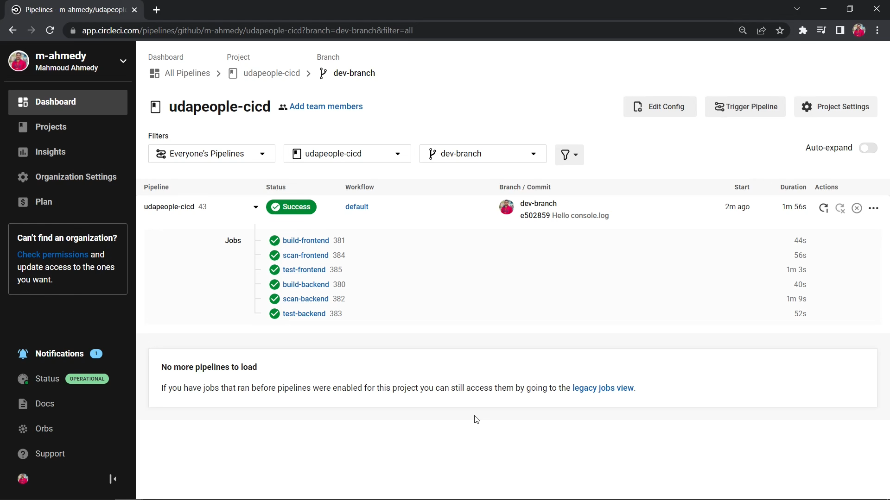

# Part 16 - Builds on branches other than the master branch

One more task remains on the pipeline before moving on to the monitoring sections, which is verifying that Continuous Deployment stages (stages starting with `deploy-infrastructure`) only runs on the Production branch, aka the `master` branch

## Objectives

- Make sure that changes on branches other than the master branch only executes CI stages on the pipeline

## Implementation

First, make sure that the `deploy-infrastructure` job has a filter that makes it run only if it's on the `master` branch

```yml
workflows:
    ...
    default:
        jobs:
            ...
            - deploy-infrastructure:
                requires: [test-frontend, test-backend, scan-frontend, scan-backend]
                filters:
                    branches:
                        only: [master]
            ...
```

On your machine open a terminal inside the project's directory, use git to create a new branch and check it out

```sh
git branch dev-branch
git checkout dev-branch
# OR
git checkout -b dev-branch
```

Add any update that won't break the app, like a `console.log` statement

`backend/src/main.ts` Line 13

```javascript
console.log("Hello from UdaPeople!");
```

---

Commit and push the changes to GitHub to trigger a workflow on CircleCI

---

The workflow will trigger, and if everything is done correctly it should complete successfully, it only executes the CI stages and stop before the deploy-infrastructure stage

Take a screenshot of the failed smoke test [**SCREENSHOT10**]



---

And now the pipeline is complete, we move on to the monitoring part
