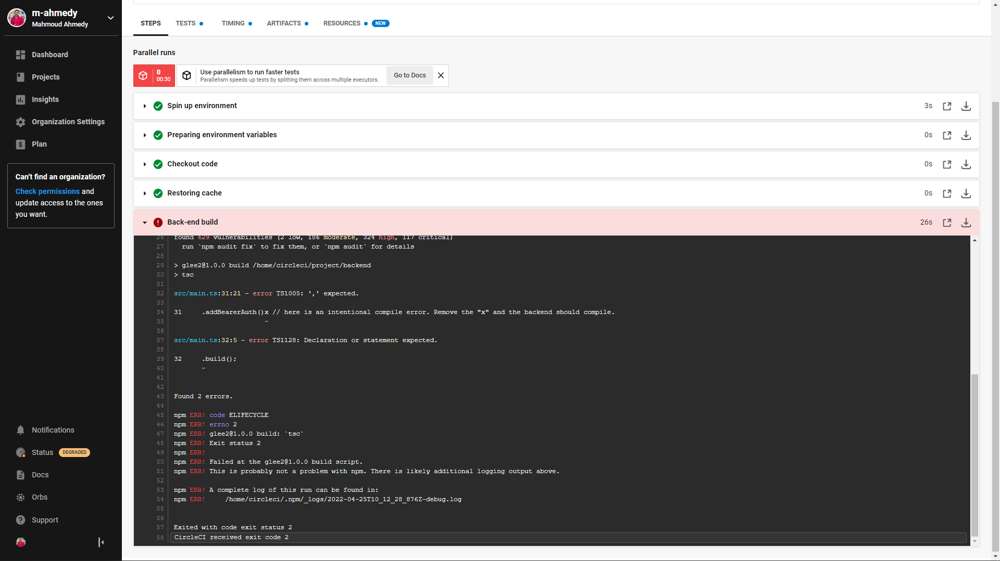
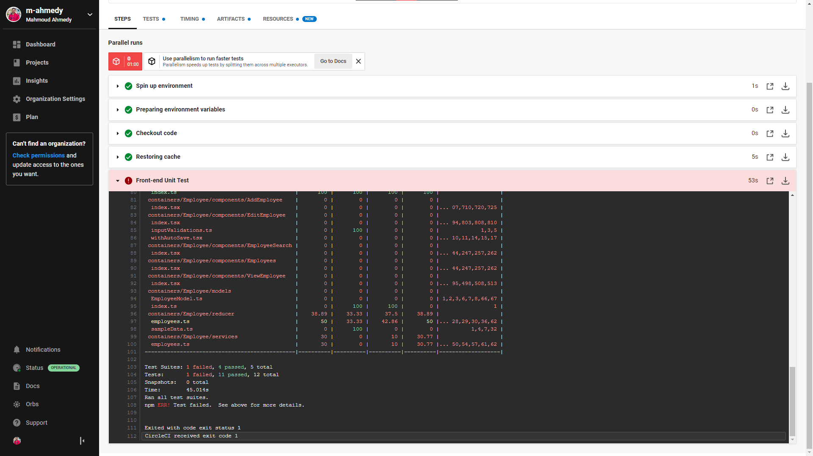
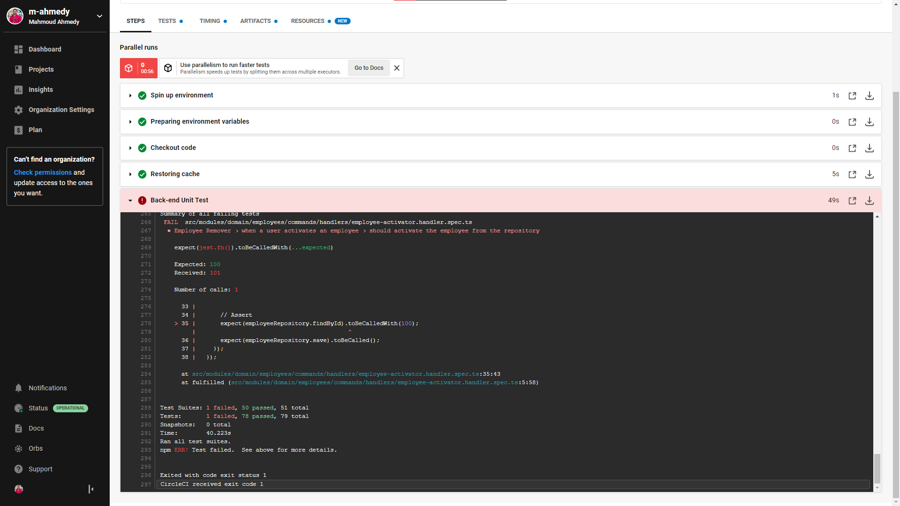
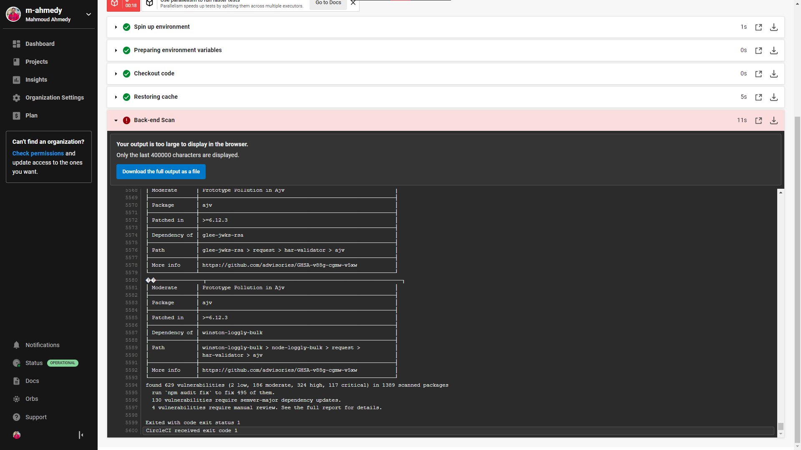

# Part 4 - CI Stages

## Objectives

- Complete CI Stages
    - Build
    - Test
    - Scan

- Submission requirements
    - Job failed because of compile errors. [**SCREENSHOT01**]
    - Job failed because of unit tests. [**SCREENSHOT02**]
    - Job that failed because of vulnerable packages. [**SCREENSHOT03**]

## CircleCI config.yml
- We will use a base image from CircleCI that supports Node.js 13.8.0
- We will use [`cimg/node:13.8.0`](https://circleci.com/developer/images/image/cimg/node), it's a convenience image provided by CircleCI that's built to run Node.js 13.8.0 on CircleCI

### Build stage

#### Jobs: build-frontend

First we define the executor environment, which will be the mentioned docker image

```yml
build-frontend:
    docker:
    - image: cimg/node:13.8.0
```

Then the **steps**:
1. `checkout` command to check out the code
    ```yml
    - checkout
    ```
2. `restore_cache`: The built-in feature in CircleCI to cache dependencies so that it doesn't take much time
    ```yml
    - restore_cache:
          keys: [frontend-deps]
    ```
3. Going into the frontend folder, installing dependencies and building the frontend
    ```yml
    - run:
        name: Build frontend
        command: |
            cd frontend
            npm install
            npm run build
    ```
4. Storing cache of the installed dependencies, the frontend dependencies are located in `frontend/node_modules`
    ```yml
    - save_cache:
        paths: [frontend/node_modules]
        key: frontend-deps
    ```

#### Jobs: build-backend

Just like the build-frontend but with the backend

First we define the executor environment, which will be the mentioned docker image

```yml
build-backend:
    docker:
    - image: cimg/node:13.8.0
```

---

Then the **steps**:
1. `checkout` command to check out the code
    ```yml
    - checkout
    ```
2. `restore_cache`: The built-in feature in CircleCI to cache dependencies so that it doesn't take much time
    ```yml
    - restore_cache:
        keys: [backend-deps]
    ```
3. Going into the backend folder, installing dependencies and building the backend
    ```yml
    - run:
        name: Build frontend
        command: |
            cd backend
            npm install
            npm run build
    ```
4. Storing cache of the installed dependencies, the backend dependencies are located in `backend/node_modules`
    ```yml
    - save_cache:
        paths: [backend/node_modules]
        key: backend-deps
    ```

#### Workflow update

Then update the workflow at the end of config.yml

```yml
workflows:
  default:
    jobs:
      - build-frontend
      - build-backend
```

---

Commit and push the changes to GitHub to trigger a workflow on CircleCI

---

A new workflow will be triggered on CircleCI

The `build-backend` job will fail due to the **intentional** compile error

Take a screenshot of the error on CircleCI, it should be something like this, this will be [**SCREENSHOT01**]



#### Fixing the error

##### Backend Compile Error Fix

Go to the specified compile error location - `backend/src/main.ts` line `31` - and remove the letter `x` and the comment

- Before
    ```js
        .addBearerAuth()x // here is an intentional compile error. Remove the "x" and the backend should compile.
    ```
- After
    ```js
        .addBearerAuth()
    ```

---

Commit the change

---

### Test stage

The same sequence will be followed for the test stages

#### Jobs: test-frontend

Executor:

```yml
test-frontend:
    docker:
    - image: cimg/node:13.8.0
```

---

Steps:

1. `checkout`
    ```yml
    - checkout
    ```
2. `restore_cache`:
    ```yml
    - restore_cache:
        keys: [frontend-deps]
    ```
3. Going into the frontend folder, installing dependencies and testing the frontend
    ```yml
    - run:
        name: Test frontend
        command: |
            cd frontend
            npm install
            npm run test
    ```

#### Jobs: test-backend

Executor:

```yml
test-backend:
    docker:
    - image: cimg/node:13.8.0
```

---

Steps:

1. `checkout`
    ```yml
    - checkout
    ```
2. `restore_cache`:
    ```yml
    - restore_cache:
        keys: [backend-deps]
    ```
3. Going into the backend folder, installing dependencies and testing the backend
    ```yml
    - run:
        name: Test backend
        command: |
            cd backend
            npm install
            npm run test
    ```

#### Workflow update

Then update the workflow at the end of config.yml

```yml
workflows:
  default:
    jobs:
      - build-frontend
      - build-backend
      - test-frontend:
          requires: [build-frontend]
      - test-backend:
          requires: [build-backend]
```

---

Commit and push the changes to GitHub to trigger a workflow on CircleCI

---

A new workflow will be triggered on CircleCI

Both `test-frontend` and `test-backend` jobs will fail due to the **intentionally** failing unit tests

Take a screenshot of one of the errors on CircleCI, it should be something like these, this will be [**SCREENSHOT02**]





#### Fixing the errors

##### Frontend Unit Test fix

Go to the failing unit test suite location - `frontend/src/app/components/LoadingMessage/LoadingMessage.spec.tsx` line `11` - and remove the question mark `?` and the comment

- Before
    ```js
        expect(wrapper.contains(<span>{message}?</span>)).toBeTruthy(); //remove the question mark to make the test pass
    ```
- After
    ```js
        expect(wrapper.contains(<span>{message}</span>)).toBeTruthy();
    ```

---

Commit the change

---

##### Backend Unit Test fix

Go to the failing unit test suite location - `backend/src/modules/domain/employees/commands/handlers/employee-activator.handler.spec.ts` line `22` - and change `101` to `100`, and remove the comment

- Before
    ```js
        const params = {
            employeeId: 101, //change this to 100 to make the test pass
            isActive: false,
        };
    ```
- After
    ```js
        const params = {
            employeeId: 100,
            isActive: false,
        };
    ```

---

Commit the change

---

### Analyze stage

The same sequence will be followed for the analysis stages

#### Jobs: scan-frontend

Executor:

```yml
scan-frontend:
    docker:
    - image: cimg/node:13.8.0
```

---

Steps:

1. `checkout`
    ```yml
    - checkout
    ```
2. `restore_cache`:
    ```yml
    - restore_cache:
        keys: [frontend-deps]
    ```
3. Going into the frontend folder, installing dependencies and run the audit for critical vulnerabilities
    ```yml
    - run:
        name: Analyze frontend
        command: |
            cd frontend
            npm install
            npm audit --audit-level=critical
    ```

#### Jobs: scan-backend

Executor:

```yml
test-backend:
    docker:
    - image: cimg/node:13.8.0
```

---

Steps:

1. `checkout`
    ```yml
    - checkout
    ```
2. `restore_cache`:
    ```yml
    - restore_cache:
        keys: [backend-deps]
    ```
3. Going into the backend folder, installing dependencies and run the audit for critical vulnerabilities
    ```yml
    - run:
        name: Build backend
        command: |
            cd backend
            npm install
            npm audit --audit-level=critical
    ```

#### Workflow update

Then update the workflow at the end of config.yml

```yml
workflows:
  default:
    jobs:
      - build-frontend
      - build-backend
      - test-frontend:
          requires: [build-frontend]
      - test-backend:
          requires: [build-backend]
      - scan-frontend:
          requires: [build-frontend]
      - scan-backend:
          requires: [build-backend]
```

---

Commit and push the changes to GitHub to trigger a workflow on CircleCI

---

A new workflow will be triggered on CircleCI

Both `scan-frontend` and `scan-backend` jobs will fail due to the vulnerable packages

Take a screenshot of one of the errors on CircleCI, it should be something like these, this will be [**SCREENSHOT03**]




#### Fixing the errors

The process of fixing vulnerabilities found in the project dependencies **is not** the responsibility of the DevOps engineer, and it **is** out of scope of the CI/CD pipeline

However, we will need our pipeline to pass, so we will use the `force fix` workaround

The `force fix` workaround **does not** fix the vulnerabilities permanently, but **only during the CI/CD pipeline** and **used only in the scan-\* stages**

The command we will use for the `force fix` workaround is
```bash
npm audit fix --force --audit-level=critical
```

##### Frontend Vulnerabilities Workaround Fix

Update the job in `.circleci/config.yml` to add the `force fix` command **just before** the audit command

- Before
    ```yaml
        - run:
            name: Analyze frontend
            command: |
                cd frontend
                npm install
                npm audit --audit-level=critical
    ```
- After
    ```yaml
        - run:
            name: Analyze frontend
            command: |
                cd frontend
                npm install
                npm audit fix --force --audit-level=critical
                npm audit --audit-level=critical
    ```

---

Commit the change

---

##### Backend Vulnerabilities Workaround Fix

First, update the job in `.circleci/config.yml` to add the `force fix` command **just before** the audit command

Backend requires the workaround **twice**

- Before
    ```yaml
        - run:
            name: Analyze backend
            command: |
                cd backend
                npm install
                npm audit --audit-level=critical
    ```
- After
    ```yaml
        - run:
            name: Analyze backend
            command: |
                cd backend
                npm install
                npm audit fix --force --audit-level=critical
                npm audit fix --force --audit-level=critical
                npm audit --audit-level=critical
    ```

Second, update `backend/package.json` with the following values

- Before
    ```json
    "class-validator": "^0.9.1",
    ```
- After
    ```json
    "class-validator": "0.12.2",
    ```

Also

- Before
    ```json
    "standard-version": "^4.4.0",
    ```
- After
    ```json
    "standard-version": "^7.0.0",
    ```

---

Commit the change

---
