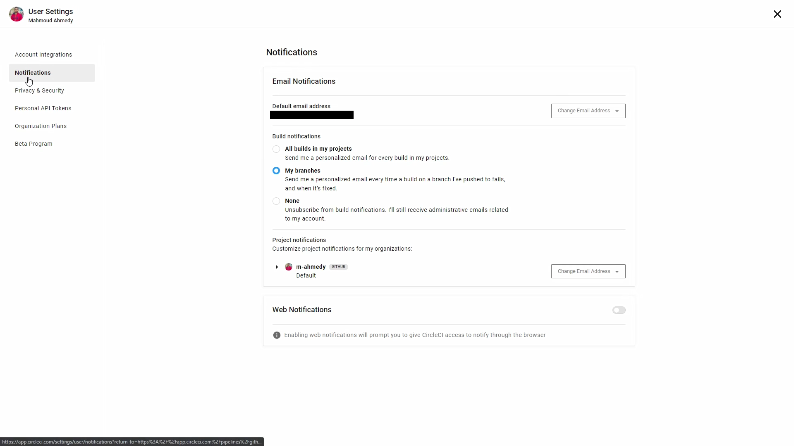
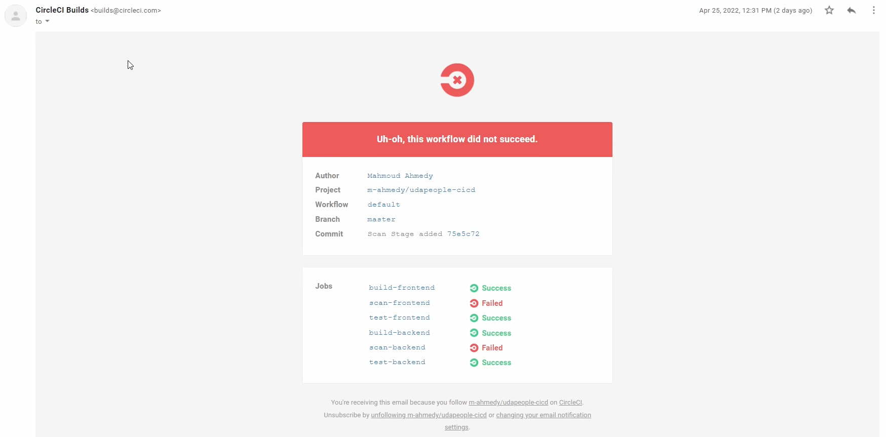
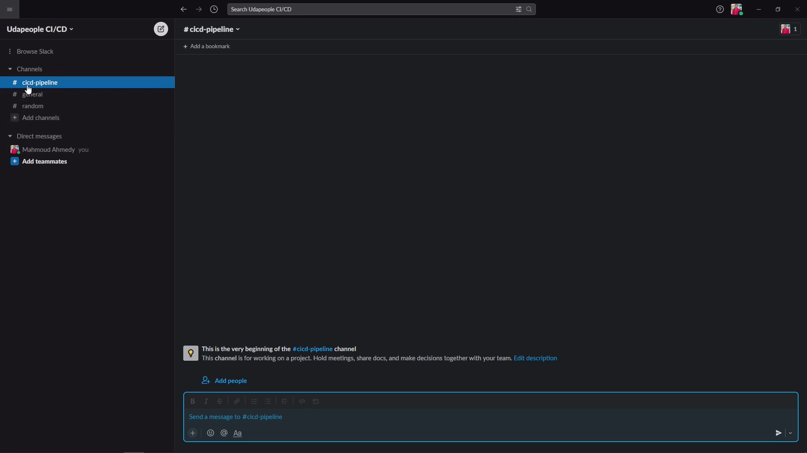
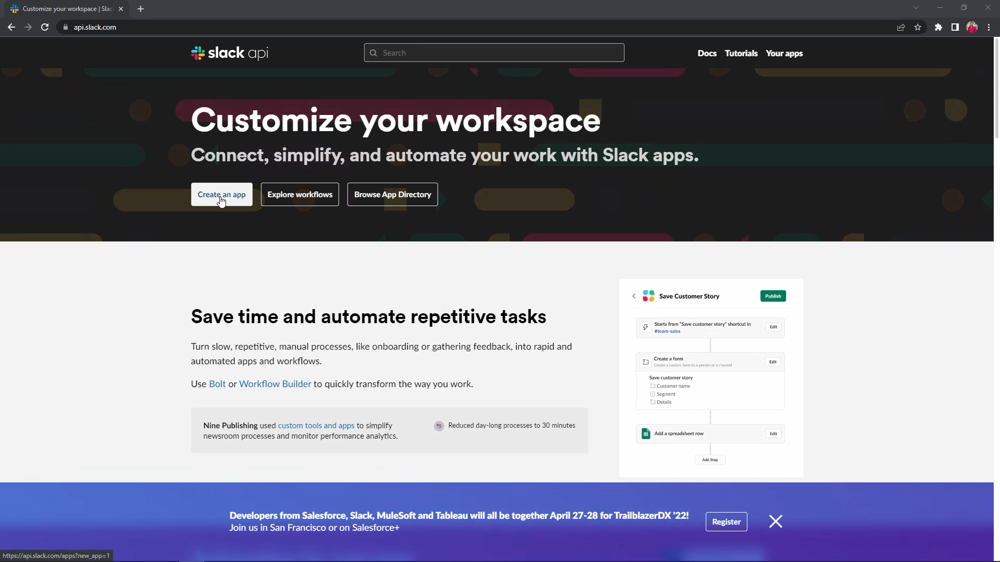
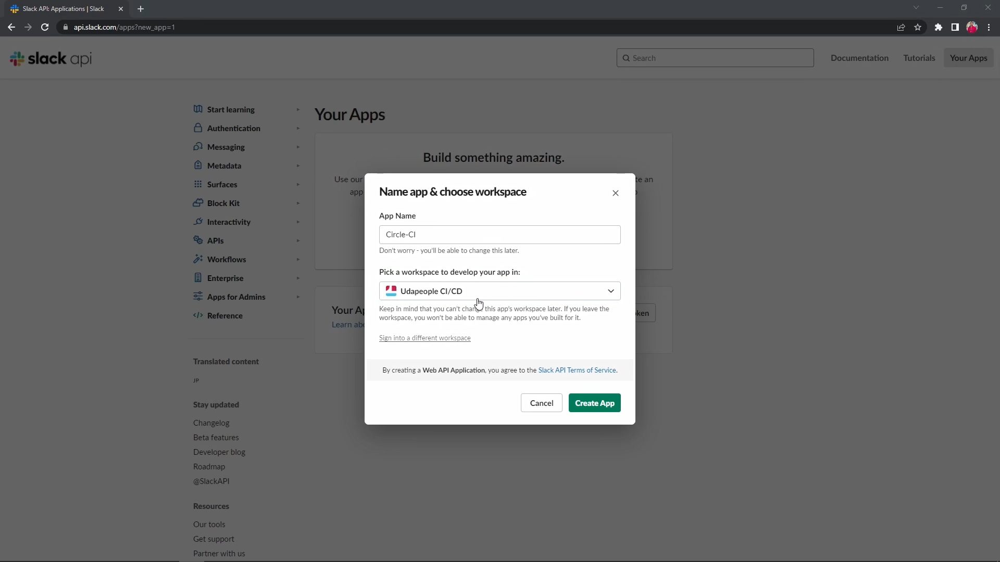
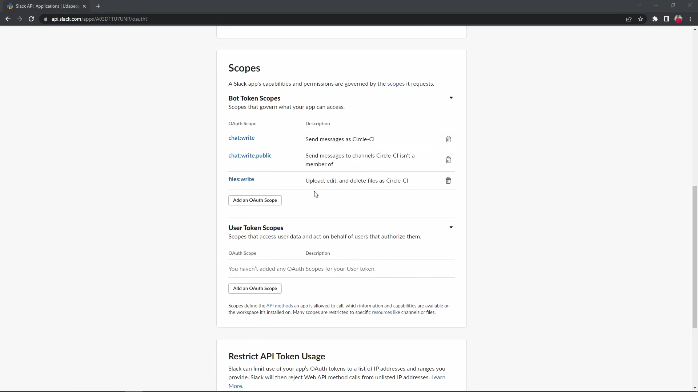
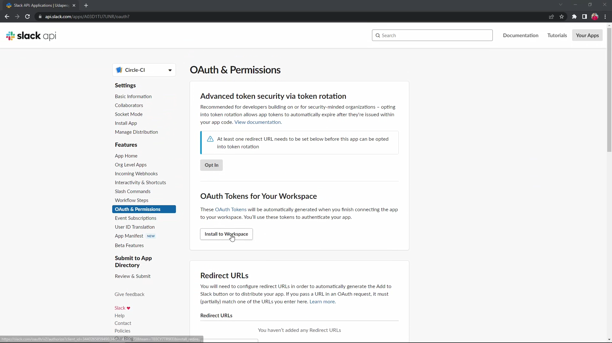
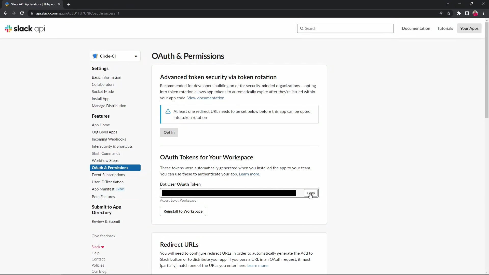
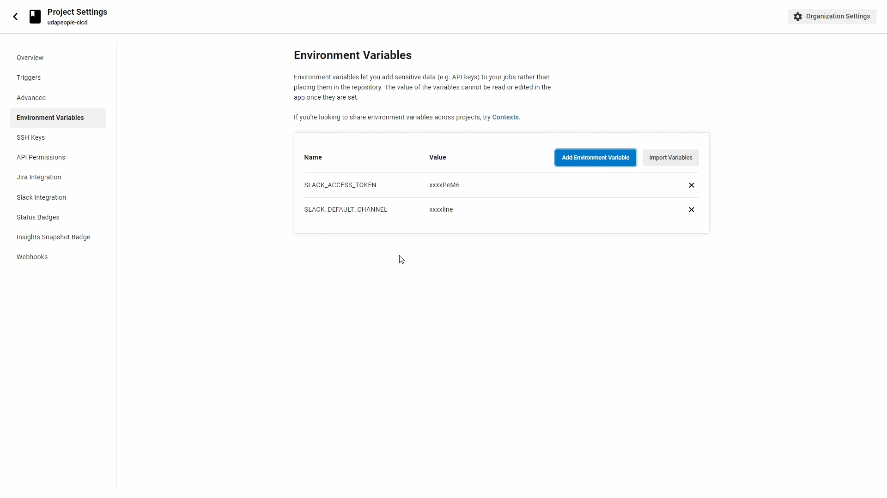

# Part 5 - Enabling Alerts

CircleCI has integrated chat, email, and web notifications.

Slack and Email notifications are delivered on the success or failure of a workflow

## Objectives

- Enable alerts on the project to notify us for failed builds on CircleCI

- Submission Requirements:
    - Provide a screenshot of an alert from one of your failed builds. [SCREENSHOT04]

## Email Notification

To set or change your default email address, visit the Notifications' page of the CircleCI application

This is gone to with the profile picture at the bottom left of app.circleci.com



You can configure your preferences here:
- **All builds in my projects** - you receive an email for every build in your project, whether it succeeds or fails.
- **My branches** - you receive an email when a build fails on a branch to which you have pushed changes.
- **None** - you receive no emails, other than administrative messages relating to your account.

---

We can take a screenshot of one of our failed builds already in our email inbox, this will be **SCREENSHOT04**



---

## Slack

Using the CircleCI Slack orb, you can integrate and customize Slack notifications directly from your `config.yml` file.

The Slack Orb is an "application" that executes as a part of your job on CircleCI. In order to receive notifications, we must authenticate our application.

### Integrating Slack with CircleCI

**The following section is intended for your OWN workspace, do not integrate with other workspaces**

**The Udapeople CI/CD is a brand-new workspace containing the channel we are sending notifications to "cicd-pipeline"**



#### Create a Slack App

- Go to [https://api.slack.com] to create a new App on Slack
- Click `Create an app`

    

- Choose `From scratch`

- Type your app name e.g. `CircleCI`, and choose the slack workspace you want to integrate this app with, here we are using OUR `Udapeople CI/CD`

    

- Go to `OAuth & Permissions` > Scopes > `Bot Token Scopes` and add the following permissions: `chat:write`, `chat:write.public` and `files:write`

    

- Install the app to the workspace at the top of the page

    

- Copy the generated `Bot User OAuth Token`

    

- Go to the project settings on **CircleCI**, and store the following environment variables
    - **SLACK_ACCESS_TOKEN**: `The token generated in the last step`
    - **SLACK_DEFAULT_CHANNEL**: For our configuration, we will use **cicd-pipeline** channel

    

### Integrating Slack Orb

#### Setting Up the Orb

- Add Slack Orb to `config.yml` orbs section

    ```yaml
    orbs: 
        slack: circleci/slack@4.10.1
    ```

- Add a command for failure notification

    ```yaml
    commands:
        notify_on_failure:
            steps:
            - slack/notify:
                event: fail
                channel: cicd-pipeline
                template: basic_fail_1
    ```

- Add a success notification job

    ```yaml
    notify_on_success:
        docker:
        - image: cimg/base:stable
        steps:
        - slack/notify:
            event: pass
            channel: cicd-pipeline
            template: success_tagged_deployment_1

    ```

#### Using the Orb

- Append the created command to jobs to notify for failures as the last step in each job

    Example: `build-backend`

    ```yaml
    ...
    - save_cache:
          paths: [backend/node_modules]
          key: backend-deps
      - notify_on_failure
    ```

    And so for other jobs

- Add the success job to the end of the workflow to notify for success on the last jobs of the workflow

    ```yaml
    workfolws:
        default:
            jobs:
            ...
            - notify_on_success:
                requires:
                    - <Last Job>
                    ...
    ```

---

Get a screenshot of a failed build notification on slack as **SCREENSHOT04**

---

For the sake of simplifying our configuration as much as possible, we will continue only with Email notifications

## Resources 

- [CircleCI Slack Setup Guide](https://github.com/CircleCI-Public/slack-orb/wiki/Setup)

- [CircleCI Slack Orb Templates](https://github.com/CircleCI-Public/slack-orb/wiki)
