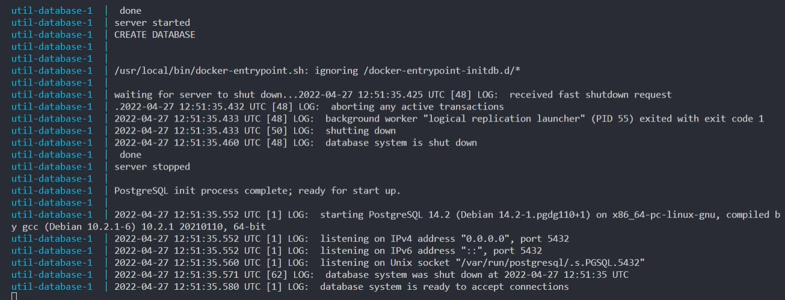
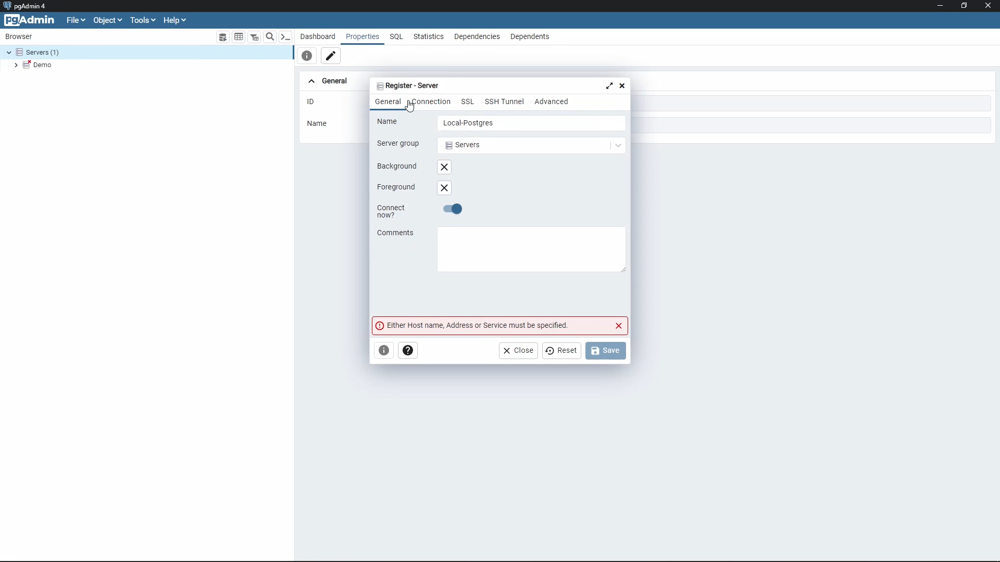
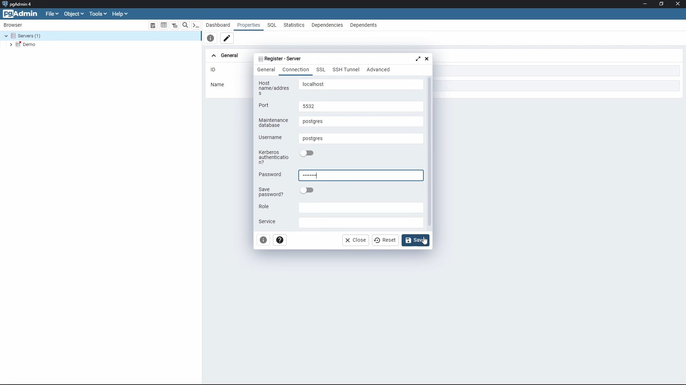
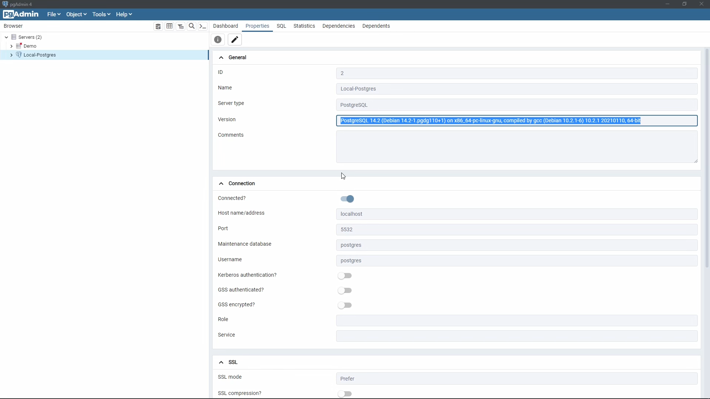
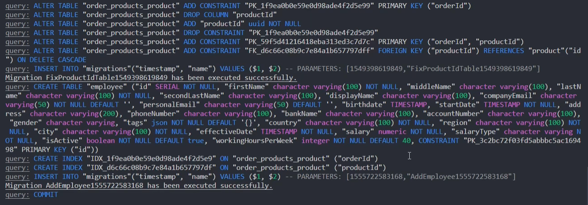
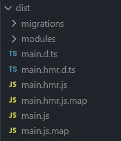
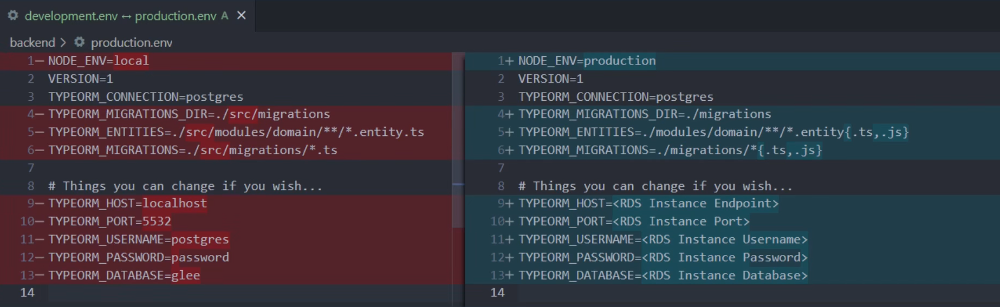
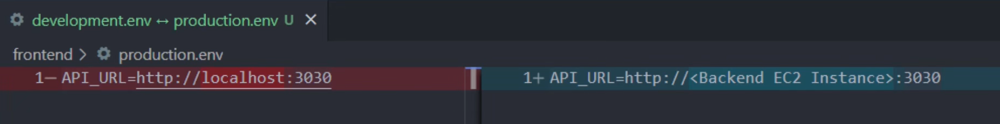

# Part 6 - Udapeople App

In this part we will examine our source code, see the sequence of steps needed to use the app in development and prod environments, and see for ourselves the app in action

This part not required to execute for the project submission, but I saw it would greatly help us when going forward

## Prerequisites

You need the following software to be installed on your local PC

- Docker Desktop (with Docker Compose)
- Node.js 13.8.0 (with NPM 6)
- pgAdmin 4

## General Steps for both Dev and Prod environments

### Spin up local database with `Docker Compose`

```sh
cd util
docker compose up
```

If we can see the log file with a line saying `database system is ready to accept connections` then the database engine is successfully created and up and running



### Check Database with pgAdmin

- Open pgAdmin and enter your master password

- From the left panel select `Servers`, from the menu bar choose `Object` > `Create` > `Server...`

- Enter Database information as shown in the `util/docker-compose.yml`

    

    

- If the connection is successfully established we can see database details in pgAdmin

    

### Install Node.js dependencies of both `frontend` and `backend`

- Frontend

    ```sh
    cd backend
    npm install
    ```

- Backend

    ```sh
    cd backend
    npm install
    ```

### Apply Database Migrations
    
```sh
cd backend

# Linux or MacOS
npm run migrations

# Windows
npm run migrations-win
```

We should see some lines in the terminal like `Migration ... has been executed successfully`



Refresh pgAdmin and check the schema, we should see multiple tables created as a result of successful migrations


## Local Development Environment

This environment uses the original source code and is intended for development only

### Save backend environment variables in `backend/.env`

See `backend/.env.sample` for reference

```
NODE_ENV=local
VERSION=1
TYPEORM_CONNECTION=postgres
TYPEORM_MIGRATIONS_DIR=./src/migrations
TYPEORM_ENTITIES=./src/modules/domain/**/*.entity.ts
TYPEORM_MIGRATIONS=./src/migrations/*.ts

# Use these values for the local PG database from the Docker Compose file
TYPEORM_HOST=localhost
TYPEORM_PORT=5532
TYPEORM_USERNAME=postgres
TYPEORM_PASSWORD=password
TYPEORM_DATABASE=glee
```

### Save the frontend environment variables in `frontend/.env`

```
API_URL=http://localhost:3030
```

### Start `frontend` and `backend` in dev mode

- Backend

    ```sh
    cd backend
    npm start
    ```

- Frontend

    ```sh
    cd frontend
    npm start
    ```

### Witness the app by opening http://localhost:3000 in the browser


You can add employees and play with the app yourself

## Local Production Environment

This environment is optimized for production, here we create a production build that will convert the source code of frontend to static files, and create a smaller optimized package of the backend

**Note**: We are using the same local database for this local production build, in real production environment we shall use a database hosted on RDS

### Generate `frontend` and `backend` in prod mode
- Backend

    ```sh
    cd backend
    npm start
    ```

    Notice the newly created folder `backend/dist`, its contents are the production build of the `backend`

    

- Frontend
    We need to set the **API_URL** environment variable **before building** the production build of the frontend

    ```sh
    cd frontend
    export API_URL=http://localhost:3030
    npm start
    ```

    Notice the newly created folder `frontend/dist`, its contents are the production build of the `frontend` source code

    

### Launch the production build of the backend
    
We need to export all backend environment variables **before launching** the production build of the backend

Some environment variables are changed, basically **TYPEORM_MIGRATIONS_DIR**, **TYPEORM_MIGRATIONS** and **TYPEORM_ENTITIES** no longer begin with `./src`, this is because we are launching the app from inside the production build folder `backend/dist`, which directly has `migrations` and `modules` folders

Also, you may notice we are using other extensions as well for both **TYPEORM_MIGRATIONS** and **TYPEORM_ENTITIES**, that's because in the production build we now have both source TypeScript `.ts` files and the generated JavaScript `.js` files, so we need to address both types of files

```sh
export NODE_ENV=local
export VERSION=1
export TYPEORM_CONNECTION=postgres
export TYPEORM_MIGRATIONS_DIR=./migrations
export TYPEORM_ENTITIES=./modules/domain/**/*.entity{.ts,.js}
export TYPEORM_MIGRATIONS=./migrations/*{.ts,.js}
export TYPEORM_HOST=localhost
export TYPEORM_PORT=5532
export TYPEORM_USERNAME=postgres
export TYPEORM_PASSWORD=password
export TYPEORM_DATABASE=glee

cd backend/dist
node main.js
```

### Launch the production build of the frontend

We have the static files in our `frontend/dist`, so we will use either live-server extension on VS Code or the `serve` package from NPM


To install the serve package

```
npm install -g serve
```

Then use it to serve the application

```sh
cd frontend/dist
serve .
```

Then open the served frontend on http://localhost:3000

## Environment Variables comparisons

When deploying the application to actual production environment we can have the following differences

### Backend



### Frontend


