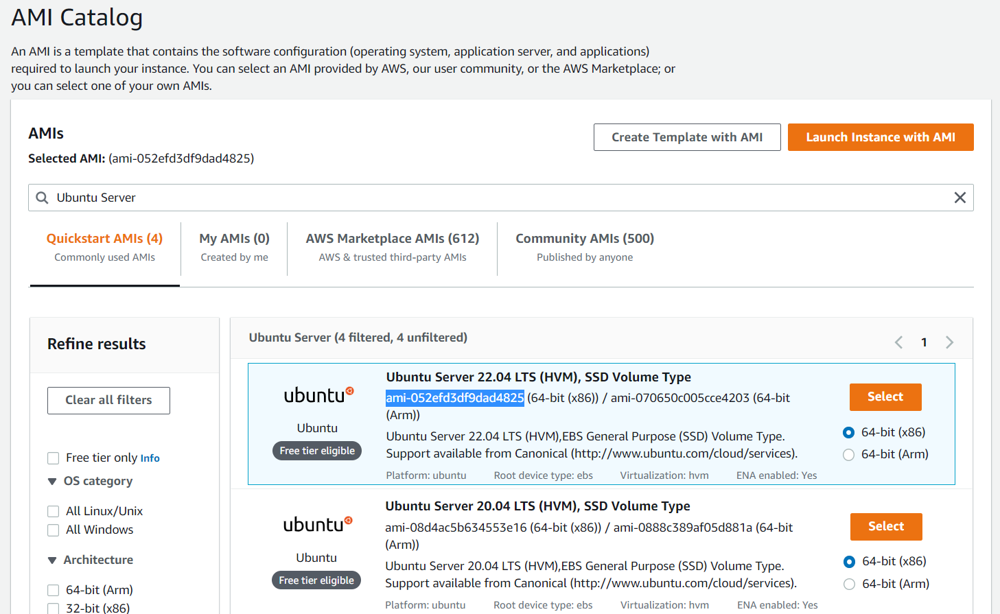
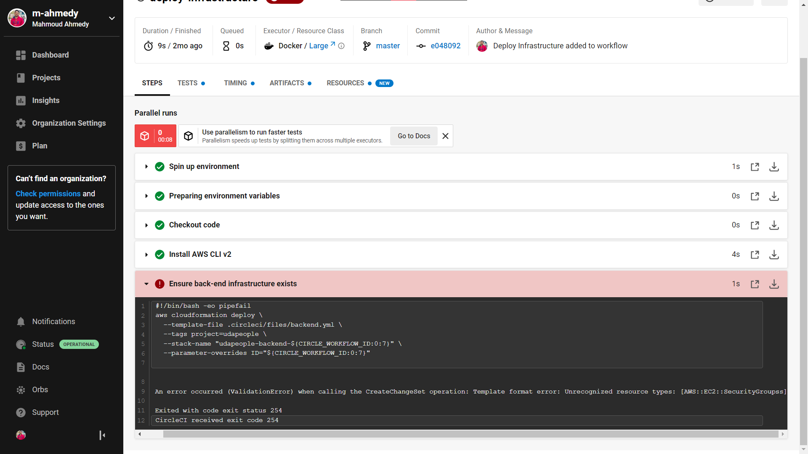

# Part 8 - Deploy Infrastructure Stage

Setting up servers and infrastructure is complicated business

There are many, many moving parts and points of failure. That’s why Udapeople adopted the IaC ("Infrastructure as Code") philosophy after their Developer got back from the last DevOps conference. We’ll need a job that executes some CloudFormation templates so that the Udapeople team never has to worry about a missed deployment checklist item

In this phase, you will add CircleCI jobs that execute Cloud Formation templates that create infrastructure as well as jobs that execute Ansible Playbooks to configure that newly created infrastructure

## Objectives

The job requires us to ensure the following is executed successfully

- Installing AWS CLI to perform automation commands against AWS
- Ensure Frontend Infrastructure exists, using `frontend.yml` template
- Ensure Backend Infrastructure exists, using `backend.yml` template
  - Use correct Key name and AMI ID
- Add IP Address to Ansible inventory
- Persist the inventory file to workspace
- Add rollback command to be executed on failure

And for the project submission

- We should make an **intentional mistake** within the template files in order to get a failure at the `deploy-infrastructure` stage

- Appropriate job failure for infrastructure creation [SCREENSHOT05]

## Overview

### A closer look inside the CloudFormation templates

Inside both the Backend template (.circleci/files/backend.yml) and the Frontend template (.circleci/files/frontend.yml), we can see that it takes in a string parameter named `ID`

`.circleci/files/backend.yml`, `.circleci/files/frontend.yml`

```yaml
Parameters:
  ID:
    Description: Unique identifier.
    Type: String
```

This parameter is used to define **two** important values

- The name of the S3 bucket inside the frontend template, it'll be named `udapeople-<ID>`

  `.circleci/files/frontend.yml`

  ```yaml
  WebsiteBucket:
    Type: AWS::S3::Bucket
    Properties:
      BucketName: !Sub "udapeople-${ID}"
  ```

- The name of the EC2 instance running our backend server, it'll be named `backend-<ID>`
  This point is important as we'll need it to filter out EC2 instance based on this unique identifier

  `.circleci/files/backend.yml`

  ```yaml
  EC2Instance:
    Type: AWS::EC2::Instance
    Properties:
      ...
      Tags:
        - Key: Name
          Value: !Sub backend-${ID}
  ```

So we need to pass a value of this parameter unique to each run of the workflow

Fortunately, CircleCI provides just that in the `CIRCLE_WORKFLOW_ID` environment variable, which is a unique sequence identifier generated for each workflow (check its value in the Prepare environment variable step of any job)

We'll use a substring of this variable, so `CIRCLE_WORKFLOW_ID:0:7` means the **first 7** characters of this value

_Note_: If we need to refer to an environment variable within a shell command, make sure to wrap it in `${VARIABLE_NAME}`

Accordingly, we need to use this exactly same value to identify each of the following

- Frontend

  - The name of the frontend stack `udapeople-frontend-<IDENTIFIER>`
  - The ID stack parameter
    - Which directly affects the name of the bucket `udapeople-<IDENTIFIER>`

- Backend
  - The name of the backend stack `udapeople-backend-<IDENTIFIER>`
  - The ID stack parameter
    - Which directly affects the name of the EC2 instance `backend-<IDENTIFIER>`

### AWS CLI refresher

After the backend stack is created, we will have to get the Public IP Address (or Public DNS Name) of the created EC2 instance with AWS CLI in order to prepare for the next stages

We can leverage [filtering capabilities](https://docs.aws.amazon.com/cli/latest/userguide/cli-usage-filter.html) of AWS CLI, we'll need both server-side and client-side filtering

#### Server-side filtering with `--filters`

We can filter out the results of `aws ec2 describe-instances` with the tag named `Name` to fetch us the results only matching this filter

```sh
--filters "Name=tag:Name,Values=backend-<IDENTIFIER>"
```

#### Client side filtering with `--query`

We can filter out the output of `aws ec2 describe-instances` with the query that gets us only the public IP address (or public DNS name)

```sh
--query 'Reservations[*].Instances[*].PublicIpAddress'
# OR
--query 'Reservations[*].Instances[*].PublicDnsName'
```

## Deploy Infrastructure Job

Executor environment, we'll use `cimg/base:stable` as discussed in the previous part

`.circleci/config.yml`

```yml
deploy-infrastructure:
  docker:
    - image: cimg/base:stable
```

---

Steps

1. `checkout` command to check out the code

   `.circleci/config.yml`

   ```yml
   - checkout
   ```

2. `install_awscli`: The command we created in the [part 7](./7-configuration-management-setup.md#add-installation-commands)

   `.circleci/config.yml`

   ```yml
   - install_awscli
   ```

3. Creating frontend infrastructure

   `.circleci/config.yml`

   ```yml
   - run:
       name: Ensure frontend infrastructure exist
       command: |
         aws cloudformation deploy \
         --template-file .circleci/files/frontend.yml \
         --tags project=udapeople \
         --stack-name "udapeople-frontend-${CIRCLE_WORKFLOW_ID:0:7}" \
         --parameter-overrides ID="${CIRCLE_WORKFLOW_ID:0:7}"
   ```

4. Creating backend infrastructure

   `.circleci/config.yml`

   ```yml
   - run:
       name: Ensure backend infrastructure exist
       command: |
         aws cloudformation deploy \
           --template-file .circleci/files/backend.yml \
           --tags project=udapeople \
           --stack-name "udapeople-backend-${CIRCLE_WORKFLOW_ID:0:7}" \
           --parameter-overrides ID="${CIRCLE_WORKFLOW_ID:0:7}"
   ```

5. Get the public IP address of the backend and save it in ansible inventory file, don't forget to use `--output text` option for raw output

   `.circleci/config.yml`

   ```yaml
   - run:
       name: Add back-end ip to ansible inventory
       command: |
         BACKEND_PUBLIC_IP=$(aws ec2 describe-instances \
           --filters "Name=tag:Name,Values=backend-${CIRCLE_WORKFLOW_ID:0:7}" \
           --query 'Reservations[*].Instances[*].PublicIpAddress' \
           --output text)
         echo $BACKEND_PUBLIC_IP >> .circleci/ansible/inventory.txt
         cat .circleci/ansible/inventory.txt
   ```

6. Persisting the inventory file for upcoming stages using the `persist_to_workspace` command

   `.circleci/config.yml`

   ```yaml
   - persist_to_workspace:
       root: ~/
       paths:
         - project/.circleci/ansible/inventory.txt
   ```

## Rollback command

We need to add rollback command to clean up the provisioned infrastructure in of **any failure** happening in the workflow from now on

This command will take in input `Workflow_ID` which defaults to the `IDENTIFIER` value we used to create and name our stacks

The steps needed are:

- Empty the frontend bucket
- Remove backend and frontend stacks

In the `commands` section we add `destroy_environment` command

`.circleci/config.yml`

```yaml
destroy-environment:
  description: Destroy back-end and front-end cloudformation stacks given a workflow ID.
  parameters:
    Workflow_ID:
      type: string
      default: ${CIRCLE_WORKFLOW_ID:0:7}
  steps:
    - run:
        name: Destroy environments
        when: on_fail
        command: |
          # Empty frontend bucket
          aws s3 rm s3://udapeople-<<parameters.Workflow_ID>> --recursive

          # Delete frontend stack
          aws cloudformation delete-stack --stack-name udapeople-frontend-<< parameters.Workflow_ID >>

          # Delete backend stack
          aws cloudformation delete-stack --stack-name udapeople-backend-<< parameters.Workflow_ID >>
```

## Workflow update

Then update the workflow at the end of config.yml

Starting from `deploy-infrastructure` stage we need to filter out commits, only commits on the **master** branch should trigger CD stages

```yml
workflows:
  default:
    jobs:
      ...
      - deploy-infrastructure:
          requires: [test-frontend, test-backend, scan-frontend, scan-backend]
          filters:
            branches:
              only: [master]
```

## Updates to backend CloudFormation template

### EC2Instance AMI ID

In EC2 instance properties we need to make sure we use a free-tier eligible **Ubuntu Server** AMI

On AWS Management Console navigate to `EC2` > `AMI Catalog`, and type `Ubuntu Server`



Copy the AMI ID of the **64-bit (x64)** version of one the free-tier eligible AMIs

Use this value to update the backend CloudFormation template

`.circleci/files/backend.yml`

```yaml
EC2Instance:
  Type: AWS::EC2::Instance
  Properties:
    ...
    ImageId: ami-052efd3df9dad4825
```

### EC2Instance Key Name

Remember to use the same **KeyName** you created in the [previous part](./7-configuration-management-setup.md#create-a-key-pair)

### Improvement: Add Elastic IP Reservation

We can improve our backend template by introducing an EIP reservation and attach it to the EC2 instance

This will result in our EC2 instance having a static public IP no matter what actions we do on that instance later on, and also it will persist sudden or accidental Stop to the instance

`.circleci/files/backend.yml`

```yaml
InstanceEIP:
  Type: AWS::EC2::EIP
  Properties:
    Domain: vpc
    InstanceId: !Ref EC2Instance
```

### Introducing an intentional error

You can introduce an error anywhere in the backend template stack, for this guide I introduced a simple typo in the resource type

`.circleci/files/backend.yml`

```yaml
Resources:
    InstanceSecurityGroup:
        Type: AWS::EC2::SecurityGroupss
        ...
```

---

Commit and push these changes to trigger a new workflow on CircleCI

---

The `deploy-infrastructure` job will fail due to the **intentional** syntax error

Take a screenshot of the error on CircleCI, it should be something like this, this will be [**SCREENSHOT05**]



---

Again, go back and fix the error you introduced

`.circleci/files/backend.yml`

```yaml
Resources:
    InstanceSecurityGroup:
        Type: AWS::EC2::SecurityGroup
        ...
```

Commit the fix, and we shall be ready for the next job
