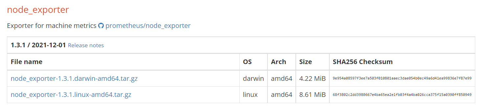

# Part 9 - Configure Infrastructure Stage

In this part we proceed on to to the `configure-infrastructure` job. In this job, you will write code to set up the EC2 instance to run as our backend

## Objectives

- Complete the Configure Server Ansible Playbook
- Complete the Configure Server Ansible Tasks
  - Install Node.js v13.8.0
  - Install PM2 process manager
- Update the Prometheus Node Exporter Ansible Task
  - Update Prometheus Node Exporter to the latest version
- Update Backend CloudFormation template
  - Open Node Exporter port
- Complete the Job steps

## Overview

In this part we have some skeleton code regarding that we need to complete and refine to prepare our EC2 instances for hosting our backend web server

Incomplete files:

- Configure Server playbook: `.circleci/ansible/configure-server.yml`
- Configure Server tasks: `.circleci/ansible/roles/configure-server/tasks/main.yml`

Files that require updates:

- Prometheus Node Exporter tasks: `.circleci/ansible/roles/configure-prometheus-node-exporter/tasks/main.yml`
- Backend CloudFormation template: `.circleci/files/backend.yml`

### Ansible playbook

We have this skeleton code of the ansible playbook in our starter code

```yml
---
- name: "configuration play."
  hosts: web
  user: ubuntu
  become: true
  become_method: sudo
  become_user: root
  gather_facts: false
  vars:
    - ansible_python_interpreter: /usr/bin/python3
    - ansible_host_key_checking: false
    - ansible_stdout_callback: yaml

  pre_tasks:
    - name: "wait 600 seconds for target connection to become reachable/usable."
      # Your code here

    - name: "install python for Ansible."
      # Your code here

  # Get the environment variables from CircleCI and add to the EC2 instance
  environment:
    - TYPEORM_CONNECTION: "{{ lookup('env', 'TYPEORM_CONNECTION')}}"
    # Add more env vars here

  roles:
    # Your code here
```

Sections to complete:

- Waiting for connection pre-task
- Verifying Python installation on the managed node pre-task
- Import environment variables from CircleCI (Not required)
- Delegate tasks to roles (`configure-server`, and `configure-prometheus-node-exporter`)

_Note_: All tasks in this playbook (and its roles) require **root** privileges, so we defined `become: true` on the play level and as a result all tasks will be executed with root privileges

#### Initial playbook config

If we are using the [Ansible extension for VS Code](https://marketplace.visualstudio.com/items?itemName=redhat.ansible) it will indicate that the `vars` section is a **map** not a **list**, so we need to update it

`.circleci/ansible/configure-server.yml`

- Before

  ```yml
  vars:
    - ansible_python_interpreter: /usr/bin/python3
    - ansible_host_key_checking: false
    - ansible_stdout_callback: yaml
  ```

- After

  ```yml
  vars:
    ansible_python_interpreter: /usr/bin/python3
    ansible_host_key_checking: false
    ansible_stdout_callback: yaml
  ```

#### Pre-tasks

For the first pre-task, we shall use `wait_for_connection` [module](https://docs.ansible.com/ansible/latest/collections/ansible/builtin/wait_for_connection_module.html#ansible-collections-ansible-builtin-wait-for-connection-module), and set the timeout to a suitable value (600 seconds is more than sufficient)

```yml
- name: "wait 600 seconds for target connection to become reachable/usable."
    wait_for_connection:
        timeout: 600
```

To verify Python 3 installation, we shall use the `apt` [module](https://docs.ansible.com/ansible/latest/collections/ansible/builtin/apt_module.html#ansible-collections-ansible-builtin-apt-module)

```yml
- name: "install python for Ansible."
   apt:
    name: python3
    update_cache: yes
```

#### Delegate tasks to Roles

In the `roles` section we will delegate the tasks to two roles

```yml
roles:
  - configure-server
  - configure-prometheus-node-exporter
```

### `configure-server` Role tasks

#### **Important**: Node.js installation workaround

It's required to install Node.js v13.8.0 on the backend instance to run our code, but normal installation methods doesn't allow us to install this version as it's now deprecated

We will use a workaround method to install this version of Node

- First we'll install the LTS version of Node.js, this version is guaranteed to work on backend Ubuntu distribution, we'll use official instructions from [NodeSource](https://github.com/nodesource/distributions#installation-instructions)

  ```sh
  curl -fsSL https://deb.nodesource.com/setup_lts.x | sudo -E bash -
  sudo apt-get install -y nodejs
  ```

- Then we can use [**n - Node.js version manager**](https://www.npmjs.com/package/n) to install and use our desired 13.8.0 version of node

  ```sh
  sudo npm install -g n
  sudo n 13.8.0
  ```

This way we can ensure that our system will have our desired version of node

We can implement this workaround in our `configure-server` tasks

```yml
---
- name: "Install Node.js 13"
  shell: |
    # Install Node.js LTS version as our base Node.js version
    curl -fsSL https://deb.nodesource.com/setup_lts.x | sudo -E bash -
    sudo apt-get install -y nodejs

    # Use n version manager to use Node.js v13.8.0
    sudo npm install -g n
    sudo n 13.8.0
```

#### Install PM2 process manager

PM2 is a production process manager for Node.js applications with a built-in load balancer. It allows you to keep applications alive forever, to reload them without downtime and to facilitate common system admin tasks.

We shall use the `npm` [module](https://docs.ansible.com/ansible/latest/collections/community/general/npm_module.html#ansible-collections-community-general-npm-module)

```yml
- name: "Install PM2 Globally"
  npm:
    name: pm2
    global: yes
```

### `configure-prometheus-node-exporter` Role tasks

Here we only need to update the version of Node Exporter that we will use to ensure compatibility with other Prometheus components later on

Go to Node Exporter [download page](https://prometheus.io/download/#node_exporter) and take a note of the latest version, here you can see it's **1.3.1**



And update tasks file with the new version (replace version 0.17.0 to the latest version)

`.circleci/ansible/roles/configure-prometheus-node-exporter/tasks/main.yml`

- Before

  ```yml
  - name: "install node exporter."
    unarchive:
      src: https://github.com/prometheus/node_exporter/releases/download/v0.17.0/node_exporter-0.17.0.linux-amd64.tar.gz
      dest: /tmp
      remote_src: yes

  - name: "move binary to /usr/local/bin."
    copy:
      src: /tmp/node_exporter-0.17.0.linux-amd64/node_exporter
      dest: /usr/local/bin/node_exporter
      remote_src: yes
      mode: "0777"
  ```

- After

  ```yml
  - name: "install node exporter."
    unarchive:
      src: https://github.com/prometheus/node_exporter/releases/download/v1.3.1/node_exporter-1.3.1.linux-amd64.tar.gz
      dest: /tmp
      remote_src: yes

  - name: "move binary to /usr/local/bin."
    become: true
    copy:
      src: /tmp/node_exporter-1.3.1.linux-amd64/node_exporter
      dest: /usr/local/bin/node_exporter
      remote_src: yes
      mode: "0777"
  ```

### Update Backend CloudFormation Template

Just a simple update to the instance security group to enable traffic on the default Node Exporter port (9100)

`.circleci/files/backend.yml`

- Before

  ```yml
  InstanceSecurityGroup:
    Type: AWS::EC2::SecurityGroup
    Properties:
        ...
        GroupDescription: Allow port 22 and port 3030.
        SecurityGroupIngress:
            ...
  ```

- After

  ```yml
  InstanceSecurityGroup:
    Type: AWS::EC2::SecurityGroup
    Properties:
        ...
        GroupDescription: Allow port 9100, 22 and port 3030.
        SecurityGroupIngress:
            ...
            - IpProtocol: tcp
              FromPort: 9100
              ToPort: 9100
              CidrIp: 0.0.0.0/0
  ```

### `configure-infrastructure` Job

Executor environment, we'll use `cimg/python:3.10` as discussed in the previous part

`.circleci/config.yml`

```yml
configure-infrastructure:
  docker:
    - image: cimg/python:3.10
```

---

Steps

1. `checkout` command to check out the code

   `.circleci/config.yml`

   ```yml
   - checkout
   ```

2. Install required tools: The commands we created in [part 7](./7-configuration-management-setup.md#add-installation-commands)

   `.circleci/config.yml`

   ```yml
   - install_awscli
   - install_ansible
   ```

3. Add SSH Fingerprint for Ansible SSH access, here we use the fingerprint created in [part 7](7-configuration-management-setup.md#add-ssh-key)

   `.circleci/config.yml`

   ```yml
   - add_ssh_keys:
       fingerprints: ["d5:a4:0d:bd:36:a7:d2:03:2c:10:93:6a:7c:d1:a7:26"]
   ```

4. Attach the workspace to retrieve the inventory file

   `.circleci/config.yml`

   ```yml
   - attach_workspace:
       at: ~/
   ```

5. Run `ansible-playbook` to run configuration play

   `.circleci/config.yml`

   ```yml
   - run:
       name: Configure Server
       command: |
         cd .circleci/ansible
         cat inventory.txt

         ansible-playbook -i inventory.txt configure-server.yml
   ```

6. In case any failure occurs, add rollback command

   `.circleci/config.yml`

   ```yml
   - destroy-environment
   ```

#### Workflow update

Then update the workflow at the end of config.yml

```yml
workflows:
  default:
    jobs:
      ...
      - configure-infrastructure:
          requires: [deploy-infrastructure]
```

---

Commit and push these changes to trigger a new workflow on CircleCI

---
